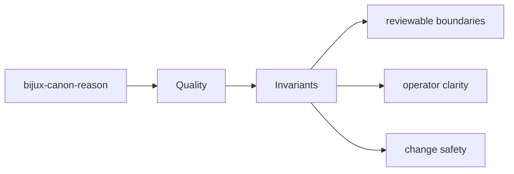

# Invariants

Invariants are the promises that should survive ordinary implementation change.

## Page Maps

## Invariant Anchors

- package boundary stays explicit
- interface and artifact contracts remain reviewable
- tests continue to prove the long-lived promises

## Supporting Tests

- tests/unit for planning, reasoning, execution, verification, and interfaces
- tests/e2e for API, CLI, replay gates, retrieval reasoning, and smoke coverage
- tests/perf for retrieval benchmark coverage
- tests/docs for documentation-linked safeguards

## Purpose

This page records the kinds of promises that should not drift casually.

## Stability

Keep it aligned with invariant-focused tests and documented package guarantees.
