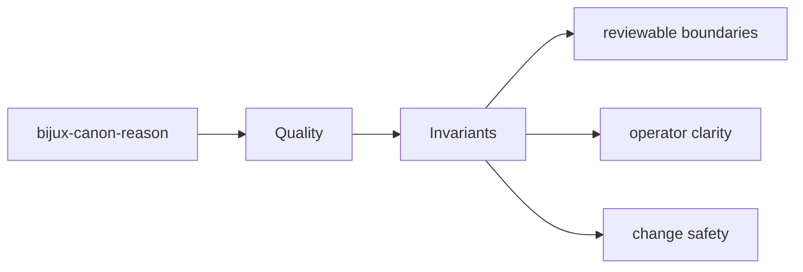
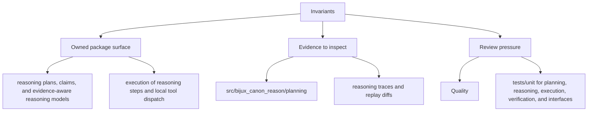

# Invariants

Invariants are the promises that should survive ordinary implementation change.

## Page Maps

## Invariant Anchors

- package boundary stays explicit
- interface and artifact contracts remain reviewable
- tests continue to prove the long-lived promises

## Supporting Tests

- tests/unit for planning, reasoning, execution, verification, and interfaces
- tests/e2e for API, CLI, replay gates, retrieval reasoning, and smoke coverage
- tests/perf for retrieval benchmark coverage
- tests/docs for documentation-linked safeguards

## Use This Page When

- you are reviewing tests, invariants, limitations, or risk
- you need evidence that the documented contract is actually protected
- you are deciding whether a change is done rather than merely implemented

## What This Page Answers

- what proves the bijux-canon-reason contract today
- which risks or limits still need explicit review
- what a reviewer should verify before accepting change

## Purpose

This page records the kinds of promises that should not drift casually.

## Stability

Keep it aligned with invariant-focused tests and documented package guarantees.
