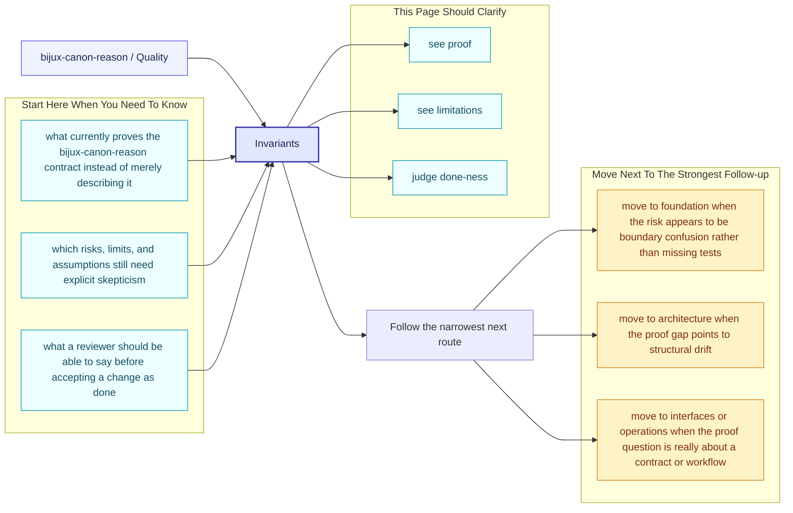
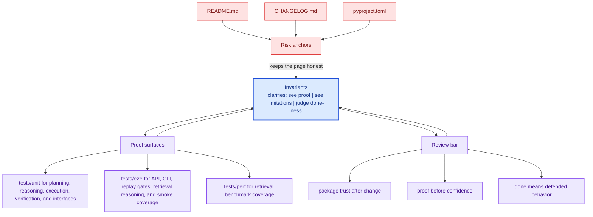

# Invariants

Invariants are the promises that should survive ordinary implementation change.

This page names the truths the package is trying hardest not to lose. If an
invariant changes, that should feel more like a design event than a routine code
edit.

Treat the quality pages for `bijux-canon-reason` as the proof frame around the package. They should show how trust is earned and where skepticism still belongs.

## Page Maps

## Invariant Anchors

- package boundary stays explicit
- interface and artifact contracts remain reviewable
- tests continue to prove the long-lived promises

## Supporting Tests

- tests/unit for planning, reasoning, execution, verification, and interfaces
- tests/e2e for API, CLI, replay gates, retrieval reasoning, and smoke coverage
- tests/perf for retrieval benchmark coverage
- tests/docs for documentation-linked safeguards

## Concrete Anchors

- tests/unit for planning, reasoning, execution, verification, and interfaces
- tests/e2e for API, CLI, replay gates, retrieval reasoning, and smoke coverage
- README.md

## Use This Page When

- you are reviewing tests, invariants, limitations, or ongoing risks
- you need evidence that the documented contract is actually defended
- you are deciding whether a change is truly done rather than merely implemented

## Decision Rule

Use `Invariants` to decide whether `bijux-canon-reason` has actually earned trust after a change. If one narrow green check hides a wider contract, risk, or validation gap, the work is not done yet.

## What This Page Answers

- what currently proves the `bijux-canon-reason` contract instead of merely describing it
- which risks, limits, and assumptions still need explicit skepticism
- what a reviewer should be able to say before accepting a change as done

## Reviewer Lens

- compare the documented proof story with the actual test layout and release posture
- look for limitations or risks that should have moved with recent behavior changes
- verify that the claimed done-ness standard still reflects real validation practice

## Honesty Boundary

This page explains how `bijux-canon-reason` is supposed to earn trust, but it does not claim that prose alone is enough. If the listed tests, checks, and review practice stop backing the story, the story has to change.

## Next Checks

- move to foundation when the risk appears to be boundary confusion rather than missing tests
- move to architecture when the proof gap points to structural drift
- move to interfaces or operations when the proof question is really about a contract or workflow

## Purpose

This page records the kinds of promises that should not drift casually.

## Stability

Keep it aligned with invariant-focused tests and documented package guarantees.
