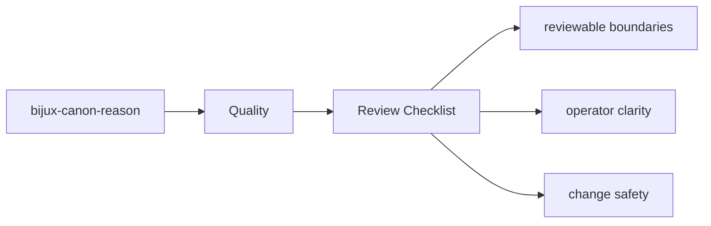

# Review Checklist

Reviewing changes in `bijux-canon-reason` should include both behavior and documentation.

## Page Maps

## Checklist

- did ownership stay inside the correct package boundary
- do interface or artifact changes have matching docs and tests
- are filenames, commit messages, and symbols still clear enough to age well

## Purpose

This page records a compact review lens for package changes.

## Stability

Update it only when the package review posture genuinely changes.
