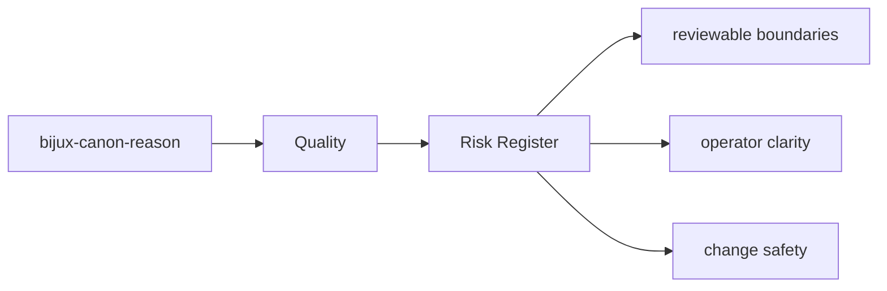
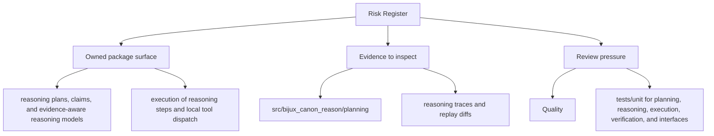

# Risk Register

The durable risks for `bijux-canon-reason` are the ones that make the package boundary, interface contract,
or produced artifacts harder to trust.

This page should keep long-lived risk language attached to the package instead
of scattering it across reviews and memory. The goal is not alarmism; it is to
help maintainers remember which failures would actually cost credibility.

Read the quality pages for `bijux-canon-reason` as the proof frame around the package. They should explain how trust is earned, how risk stays visible, and why a passing local check is not always enough.

## Page Maps

## Ongoing Risks to Watch

- hidden overlap with neighboring packages
- drift between docs, code, and tests
- compatibility changes that are not made explicit

## Concrete Anchors

- tests/unit for planning, reasoning, execution, verification, and interfaces
- tests/e2e for API, CLI, replay gates, retrieval reasoning, and smoke coverage
- README.md

## Use This Page When

- you are reviewing tests, invariants, limitations, or ongoing risks
- you need evidence that the documented contract is actually defended
- you are deciding whether a change is truly done rather than merely implemented

## Decision Rule

Use `Risk Register` to decide whether `bijux-canon-reason` has actually earned trust after a change. If one narrow green check hides a wider contract, risk, or validation gap, the work is not done yet.

## Next Checks

- move to foundation when the risk appears to be boundary confusion rather than missing tests
- move to architecture when the proof gap points to structural drift
- move to interfaces or operations when the proof question is really about a contract or workflow

## Update This Page When

- test layout, invariant protection, or risk posture changes materially
- definition-of-done or validation practice changes in a way reviewers must understand
- known limitations or evidence expectations move with the codebase

## What This Page Answers

- what currently proves the `bijux-canon-reason` contract instead of merely describing it
- which risks, limits, and assumptions still need explicit skepticism
- what a reviewer should be able to say before accepting a change as done

## Reviewer Lens

- compare the documented proof story with the actual test layout and release posture
- look for limitations or risks that should have moved with recent behavior changes
- verify that the claimed done-ness standard still reflects real validation practice

## Honesty Boundary

This page explains how bijux-canon-reason protects itself, but it does not claim that prose alone is enough without the listed tests, checks, and review practice.

## Purpose

This page keeps long-lived package risks visible to maintainers.

## Stability

Update it when the durable risk profile changes, not for routine day-to-day churn.

## What Good Looks Like

- `Risk Register` leaves a reviewer able to say why the package should be trusted after a change
- tests, limitations, and risk language reinforce one another instead of competing
- the completion bar is demanding enough to prevent shallow acceptance

## Failure Signals

- `Risk Register` says the package is protected but cannot show which proof closes which risk
- reviewers disagree on whether the work is done because the standard is too implicit
- limitations remain unchanged even when package behavior has obviously shifted

## Tradeoffs To Hold

- prefer broader proof over narrower green checks when the package contract is larger than one code path
- prefer visible limitations over a cleaner story that hides risk
- prefer a slightly slower approval path over granting `bijux-canon-reason` trust without enough evidence

## Cross Implications

- changes here influence how all other `bijux-canon-reason` sections should be trusted after modification
- foundation, architecture, interface, and operations claims all become weaker if proof expectations drift
- review discipline here determines whether neighboring sections remain explanatory or merely aspirational

## Approval Questions

- does `Risk Register` show enough proof to trust `bijux-canon-reason` after change
- have limitations and known risks moved with the code rather than staying stale
- does the acceptance bar protect the package contract instead of only one local behavior

## Evidence Checklist

- read `packages/bijux-canon-reason/tests` with the page's proof claims in hand
- verify package metadata and release notes in `packages/bijux-canon-reason` do not contradict the review standard
- check whether known limitations, risks, and completion language all moved together in the current change

## Anti-Patterns

- equating one local pass with full contract confidence
- keeping old risk prose after the code and tests have materially changed
- treating definition-of-done language as ceremonial rather than operational

## Escalate When

- the proof story can no longer be updated without revisiting adjacent sections
- a local validation gap reveals a larger boundary or architecture issue
- reviewers cannot agree on done-ness because the underlying contract changed

## Core Claim

The quality claim of `bijux-canon-reason` is that tests, invariants, risks, and completion criteria jointly prove whether the package is trustworthy after change.

## Why It Matters

If the quality pages for `bijux-canon-reason` are weak, it becomes difficult to tell whether a change is actually safe or merely passes a narrow local test.

## If It Drifts

- reviewers cannot tell whether the listed proof still covers the real risk surface
- limitations stop being visible until they show up as rework later
- definition-of-done language drifts away from actual validation practice

## Representative Scenario

A change appears correct locally, but the reviewer still needs to know whether `bijux-canon-reason` has actually satisfied its proof obligations before the work is accepted.

## Source Of Truth Order

- `packages/bijux-canon-reason/tests` for executable proof
- `packages/bijux-canon-reason/pyproject.toml` for declared package constraints
- this page for the review lens that explains how to read that proof

## Common Misreadings

- that a passing local test automatically satisfies the package review standard
- that documented risks are static and do not need to move with the code
- that the definition of done is only about implementation rather than proof
