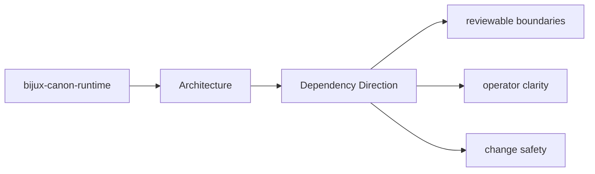

# Dependency Direction

The package should keep dependency direction readable: domain intent near the center,
interfaces and infrastructure at the edges.

## Page Maps

## Directional Reading Order

- domain and model concerns under the core module groups
- application orchestration that composes domain behavior
- interfaces, APIs, and adapters that sit at the boundary

## Concrete Anchors

- `src/bijux_canon_runtime/model` for durable runtime models
- `src/bijux_canon_runtime/runtime` for execution engines and lifecycle logic
- `src/bijux_canon_runtime/application` for orchestration and replay coordination
- `src/bijux_canon_runtime/verification` for runtime-level validation support
- `src/bijux_canon_runtime/interfaces` for CLI surfaces and manifest loading
- `src/bijux_canon_runtime/api` for HTTP application surfaces

## Purpose

This page makes dependency direction explicit enough to review during refactors.

## Stability

Keep it aligned with current imports and directory responsibilities.
