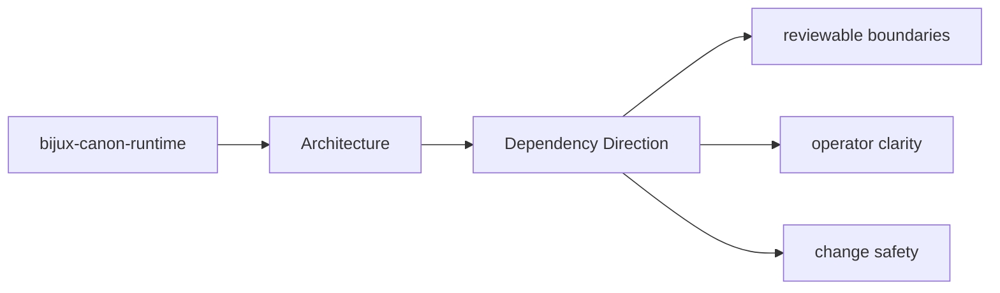
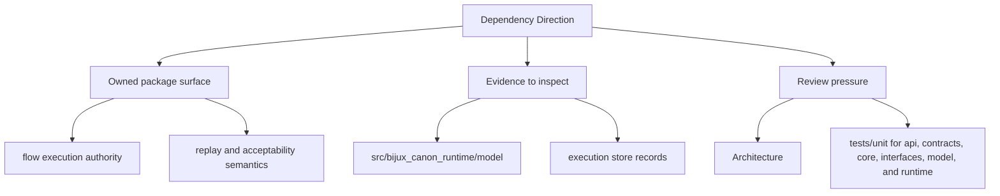

# Dependency Direction

The package should keep dependency direction readable: domain intent near the center,
interfaces and infrastructure at the edges.

## Page Maps

## Directional Reading Order

- domain and model concerns under the core module groups
- application orchestration that composes domain behavior
- interfaces, APIs, and adapters that sit at the boundary

## Core Claim

The architectural claim of `bijux-canon-runtime` is that its structure is deliberate enough for a reviewer to trace responsibilities, dependencies, and drift pressure without reverse-engineering the entire codebase.

## Concrete Anchors

- `src/bijux_canon_runtime/model` for durable runtime models
- `src/bijux_canon_runtime/runtime` for execution engines and lifecycle logic
- `src/bijux_canon_runtime/application` for orchestration and replay coordination
- `src/bijux_canon_runtime/verification` for runtime-level validation support
- `src/bijux_canon_runtime/interfaces` for CLI surfaces and manifest loading
- `src/bijux_canon_runtime/api` for HTTP application surfaces

## Concrete Anchors

- `src/bijux_canon_runtime/model` for durable runtime models
- `src/bijux_canon_runtime/runtime` for execution engines and lifecycle logic
- `src/bijux_canon_runtime/application` for orchestration and replay coordination

## Use This Page When

- you are tracing internal structure or execution flow
- you need to understand where modules fit before refactoring
- you are reviewing architectural drift instead of one local bug

## What This Page Answers

- how bijux-canon-runtime is structured internally
- which modules control the main execution path
- where architectural drift would become visible first

## Reviewer Lens

- trace the claimed execution path through the listed modules
- look for dependency direction that now contradicts the documented seam
- verify that architectural risks still match the current code structure

## Honesty Boundary

This page describes the current structural model of bijux-canon-runtime, but it does not by itself prove that every import or runtime path still obeys that model.

## Purpose

This page makes dependency direction explicit enough to review during refactors.

## Stability

Keep it aligned with current imports and directory responsibilities.
