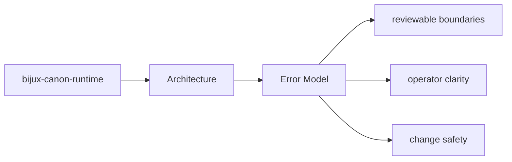
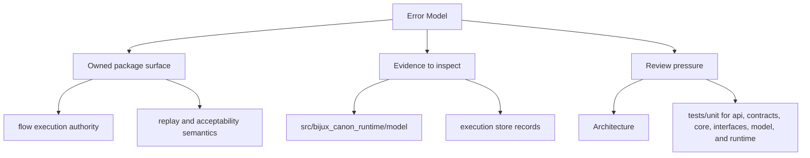

# Error Model

The package error model should make it clear which failures are local validation issues,
which are dependency failures, and which are contract violations.

Good error explanations reduce two kinds of waste at once: operator confusion in
the moment and architectural confusion during later review. The package should
fail in ways that still preserve the boundary story.

Read the architecture pages for `bijux-canon-runtime` as a reviewer-facing map of structure and flow. They should shorten code reading, not try to replace it, and they should make drift visible before it becomes surprising.

## Page Maps

## Review Anchors

- inspect interface modules for operator-facing error shape
- inspect application and domain modules for orchestration failures
- inspect tests for the failure cases the package already protects

## Test Areas

- tests/unit for api, contracts, core, interfaces, model, and runtime
- tests/e2e for governed flow behavior
- tests/regression and tests/smoke for replay and storage protection
- tests/golden for durable example fixtures

## Concrete Anchors

- `src/bijux_canon_runtime/model` for durable runtime models
- `src/bijux_canon_runtime/runtime` for execution engines and lifecycle logic
- `src/bijux_canon_runtime/application` for orchestration and replay coordination

## Use This Page When

- you are tracing structure, execution flow, or dependency pressure
- you need to understand how modules fit before refactoring
- you are reviewing design drift rather than one isolated bug

## Decision Rule

Use `Error Model` to decide whether a structural change makes `bijux-canon-runtime` easier or harder to explain in terms of modules, dependency direction, and execution flow. If the change works only because the design becomes harder to read, the safer answer is redesign rather than acceptance.

## Next Checks

- move to interfaces when the review reaches a public or operator-facing seam
- move to operations when the concern becomes repeatable runtime behavior
- move to quality when you need proof that the documented structure is still protected

## Update This Page When

- module responsibilities or dependency direction change materially
- new execution pathways or structural seams become important to review
- architectural risk shifts enough that the current map is misleading

## What This Page Answers

- how `bijux-canon-runtime` is organized internally in terms a reviewer can follow
- which modules carry the main execution and dependency story
- where structural drift would show up before it becomes expensive

## Reviewer Lens

- trace the described execution path through the named modules instead of trusting the diagram alone
- look for dependency direction or layering that now contradicts the documented seam
- verify that the structural risks named here still match the current code shape

## Honesty Boundary

This page describes the current structural model of bijux-canon-runtime, but it does not by itself prove that every import or runtime path still obeys that model.

## Purpose

This page records how to reason about failures in architecture review.

## Stability

Keep it aligned with the actual error-handling behavior and tests.

## What Good Looks Like

- `Error Model` lets a reviewer trace structure without guessing where the real pathway lives
- the documented module relationships make refactors easier to reason about before code is changed
- the page shortens code reading by pointing at the right structural hotspots first

## Failure Signals

- `Error Model` points to modules that no longer carry the behavior the page claims they do
- dependency direction has to be explained with caveats instead of a clean structural story
- the path from interface to domain to proof no longer feels traceable in one pass

## Tradeoffs To Hold

- prefer clean dependency direction over short-term coupling that makes one change easier today
- prefer an execution path that can be explained quickly over indirection that only looks flexible
- prefer structural legibility in `bijux-canon-runtime` over squeezing unrelated behavior into the same module seam

## Cross Implications

- changes here alter how interface, operations, and quality pages for `bijux-canon-runtime` should be read
- structural drift often becomes visible in caller-facing seams before it is obvious in prose
- quality expectations need to move when the architecture adds new execution or dependency pressure

## Approval Questions

- does `Error Model` still describe a structure that a reviewer can trace without caveats
- is dependency direction cleaner or at least no less legible after the change
- can the claimed execution path be matched to concrete modules, seams, and proof assets

## Evidence Checklist

- open the listed structural modules in `packages/bijux-canon-runtime/src/bijux_canon_runtime` and trace whether they still match the page narrative
- inspect `packages/bijux-canon-runtime/tests` for regressions that reveal changed execution or dependency structure
- compare the documented hotspots with the actual changed files in the review

## Anti-Patterns

- explaining structure with diagrams that no longer match the modules listed
- treating temporary implementation shortcuts as if they were enduring architectural seams
- allowing dependency direction to drift because the code still happens to run

## Escalate When

- the documented structure no longer matches the changed execution path
- a local refactor introduces a dependency direction question that affects other sections
- the review cannot explain the change without redefining a major seam

## Core Claim

The architectural claim of `bijux-canon-runtime` is that its structure is deliberate enough for a reviewer to trace responsibilities, dependencies, and drift pressure without reverse-engineering the entire codebase.

## Why It Matters

If the architecture pages for `bijux-canon-runtime` are weak, refactors become guesswork and dependency drift can hide until failures show up in tests or production-facing behavior.

## If It Drifts

- dependency direction becomes harder to inspect quickly
- refactors can land without anyone noticing structural regressions until later
- code navigation becomes slower because the documented map no longer matches reality

## Representative Scenario

A reviewer is tracing a refactor through `bijux-canon-runtime` and needs to know whether the changed modules still line up with the documented execution and dependency structure.

## Source Of Truth Order

- `packages/bijux-canon-runtime/src/bijux_canon_runtime` for the actual dependency and module structure
- `packages/bijux-canon-runtime/tests` for structural and behavioral regressions
- this page for the reviewer-facing map that should remain aligned with those assets

## Common Misreadings

- that the documented module map guarantees every import is still clean automatically
- that one current implementation path is the whole architecture contract
- that diagrams replace the need to inspect the concrete modules listed here
