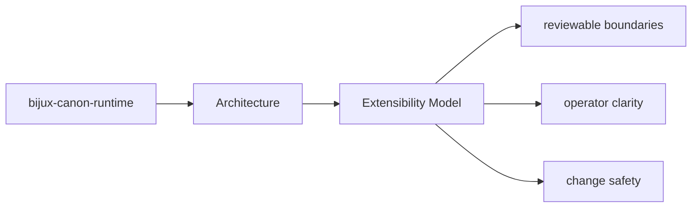

# Extensibility Model

Extension work should use the package seams that already exist instead of bypassing ownership.

## Page Maps

## Likely Extension Areas

- `src/bijux_canon_runtime/model` for durable runtime models
- `src/bijux_canon_runtime/runtime` for execution engines and lifecycle logic
- `src/bijux_canon_runtime/application` for orchestration and replay coordination
- `src/bijux_canon_runtime/verification` for runtime-level validation support
- `src/bijux_canon_runtime/interfaces` for CLI surfaces and manifest loading
- `src/bijux_canon_runtime/api` for HTTP application surfaces

## Extension Rule

Add extension points where the package already expects variation, and document them next to the owning boundary.

## Purpose

This page helps maintainers extend the package without smearing responsibilities together.

## Stability

Keep it aligned with the package seams that actually support extension today.
