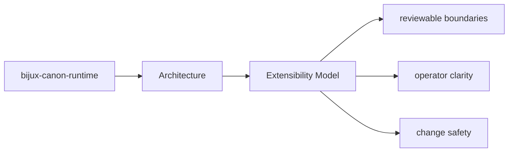
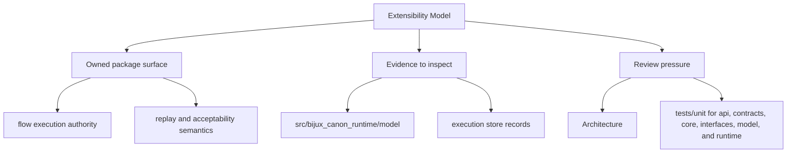

# Extensibility Model

Extension work should use the package seams that already exist instead of bypassing ownership.

Read the architecture pages for `bijux-canon-runtime` as a reviewer-facing map of structure and flow: they should be detailed enough to shorten code reading without pretending to replace it.

## Page Maps

## Likely Extension Areas

- `src/bijux_canon_runtime/model` for durable runtime models
- `src/bijux_canon_runtime/runtime` for execution engines and lifecycle logic
- `src/bijux_canon_runtime/application` for orchestration and replay coordination
- `src/bijux_canon_runtime/verification` for runtime-level validation support
- `src/bijux_canon_runtime/interfaces` for CLI surfaces and manifest loading
- `src/bijux_canon_runtime/api` for HTTP application surfaces

## Extension Rule

Add extension points where the package already expects variation, and document them next to the owning boundary.

## Concrete Anchors

- `src/bijux_canon_runtime/model` for durable runtime models
- `src/bijux_canon_runtime/runtime` for execution engines and lifecycle logic
- `src/bijux_canon_runtime/application` for orchestration and replay coordination

## Use This Page When

- you are tracing internal structure or execution flow
- you need to understand where modules fit before refactoring
- you are reviewing architectural drift instead of one local bug

## Next Checks

- move to interfaces when the review reaches a public or operator-facing seam
- move to operations when the concern becomes repeatable runtime behavior
- move to quality when you need proof that the documented structure is still protected

## Update This Page When

- module responsibilities or dependency direction change materially
- new execution pathways or structural seams become important to review
- architectural risk shifts enough that the current map is misleading

## What This Page Answers

- how bijux-canon-runtime is structured internally
- which modules control the main execution path
- where architectural drift would become visible first

## Reviewer Lens

- trace the claimed execution path through the listed modules
- look for dependency direction that now contradicts the documented seam
- verify that architectural risks still match the current code structure

## Honesty Boundary

This page describes the current structural model of bijux-canon-runtime, but it does not by itself prove that every import or runtime path still obeys that model.

## Purpose

This page helps maintainers extend the package without smearing responsibilities together.

## Stability

Keep it aligned with the package seams that actually support extension today.

## Core Claim

The architectural claim of `bijux-canon-runtime` is that its structure is deliberate enough for a reviewer to trace responsibilities, dependencies, and drift pressure without reverse-engineering the entire codebase.

## Why It Matters

If the architecture pages for `bijux-canon-runtime` are weak, refactors become guesswork and dependency drift can hide until failures show up in tests or production-facing behavior.

## If It Drifts

- dependency direction becomes harder to inspect quickly
- refactors can land without anyone noticing structural regressions until later
- code navigation becomes slower because the documented map no longer matches reality

## Representative Scenario

A reviewer is tracing a refactor through `bijux-canon-runtime` and needs to know whether the changed modules still line up with the documented execution and dependency structure.

## Source Of Truth Order

- `packages/bijux-canon-runtime/src/bijux_canon_runtime` for the actual dependency and module structure
- `packages/bijux-canon-runtime/tests` for structural and behavioral regressions
- this page for the reviewer-facing map that should remain aligned with those assets

## Common Misreadings

- that the documented module map guarantees every import is still clean automatically
- that one current implementation path is the whole architecture contract
- that diagrams replace the need to inspect the concrete modules listed here
