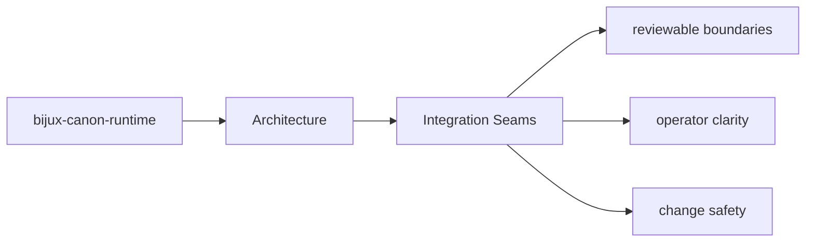
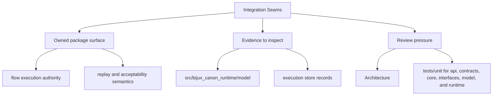

# Integration Seams

Integration seams are the points where `bijux-canon-runtime` meets configuration, APIs,
operators, or neighboring packages.

## Page Maps

## Integration Surfaces

- CLI entrypoint in src/bijux_canon_runtime/interfaces/cli/entrypoint.py
- HTTP app in src/bijux_canon_runtime/api/v1
- schema files in apis/bijux-canon-runtime/v1

## Adjacent Systems

- governs the other canonical packages instead of replacing their local ownership
- is the final authority for run acceptance, replay evaluation, and stored evidence

## What This Page Answers

- how bijux-canon-runtime is structured internally
- which modules control the main execution path
- where architectural drift would become visible first

## Purpose

This page explains where to look when integration behavior changes.

## Stability

Keep it aligned with real boundary modules and schema files.
