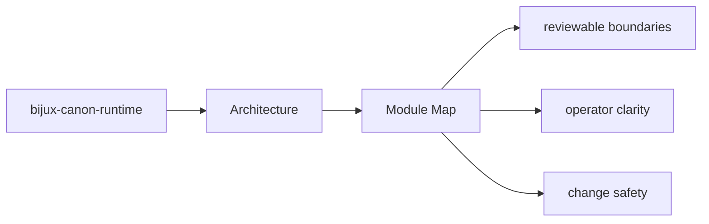
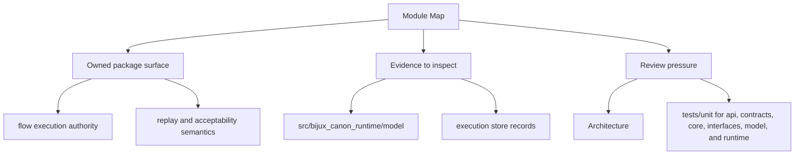

# Module Map

The architecture of `bijux-canon-runtime` is easiest to understand from the major module groups.

## Page Maps

## Major Modules

- `src/bijux_canon_runtime/model` for durable runtime models
- `src/bijux_canon_runtime/runtime` for execution engines and lifecycle logic
- `src/bijux_canon_runtime/application` for orchestration and replay coordination
- `src/bijux_canon_runtime/verification` for runtime-level validation support
- `src/bijux_canon_runtime/interfaces` for CLI surfaces and manifest loading
- `src/bijux_canon_runtime/api` for HTTP application surfaces

## Use This Page When

- you are tracing internal structure or execution flow
- you need to understand where modules fit before refactoring
- you are reviewing architectural drift instead of one local bug

## What This Page Answers

- how bijux-canon-runtime is structured internally
- which modules control the main execution path
- where architectural drift would become visible first

## Purpose

This page provides a shortest-path code map for the package.

## Stability

Keep it aligned with the actual source directories under `packages/bijux-canon-runtime`.
