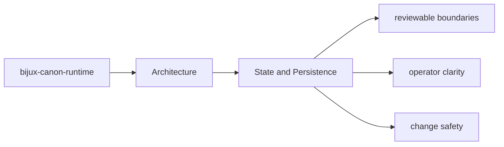

# State and Persistence

State in `bijux-canon-runtime` should be explicit enough that a maintainer can say what is
transient, what is serialized, and what neighboring packages must not assume.

## Page Maps

## Durable Surfaces

- execution store records
- replay decision artifacts
- non-determinism policy evaluations

## Code Areas to Inspect

- `src/bijux_canon_runtime/model` for durable runtime models
- `src/bijux_canon_runtime/runtime` for execution engines and lifecycle logic
- `src/bijux_canon_runtime/application` for orchestration and replay coordination
- `src/bijux_canon_runtime/verification` for runtime-level validation support
- `src/bijux_canon_runtime/interfaces` for CLI surfaces and manifest loading
- `src/bijux_canon_runtime/api` for HTTP application surfaces

## Purpose

This page marks the package's state and artifact boundary.

## Stability

Keep it aligned with the actual artifact shapes and serialized outputs.
