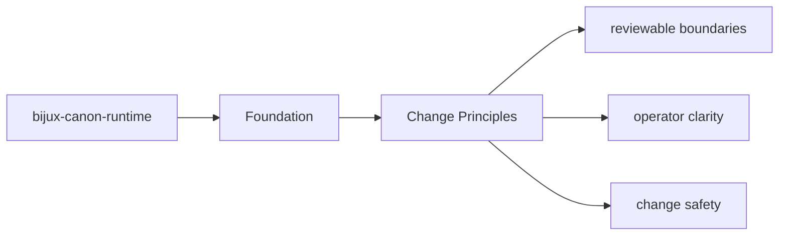
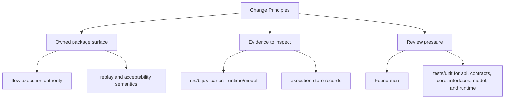

# Change Principles

Changes in `bijux-canon-runtime` should keep the package boundary easier to understand, not harder.

## Page Maps

## Principles

- prefer moving behavior toward the owning package instead of letting boundary overlap grow
- update docs and tests in the same change series that changes package behavior
- keep names stable and descriptive enough to survive years of maintenance

## Concrete Anchors

- `packages/bijux-canon-runtime` as the package root
- `packages/bijux-canon-runtime/src/bijux_canon_runtime` as the import boundary
- `packages/bijux-canon-runtime/tests` as the package proof surface

## Use This Page When

- you need the package boundary before reading implementation detail
- you are deciding whether work belongs in this package or a neighboring one
- you need the shortest stable description of package intent

## What This Page Answers

- what bijux-canon-runtime is expected to own
- what remains outside the package boundary
- which neighboring seams a reviewer should compare next

## Reviewer Lens

- compare the stated package boundary with the owned modules and tests
- check that out-of-scope work is not quietly reintroduced through adjacent packages
- confirm that the package description still matches the real repository layout

## Honesty Boundary

This page can explain the intended boundary of bijux-canon-runtime, but it does not replace the code and tests that ultimately prove that boundary.

## Purpose

This page records the package-specific contribution posture.

## Stability

Update these principles only when the package operating model truly changes.
