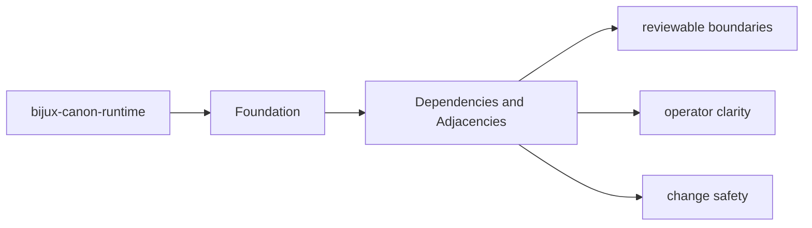
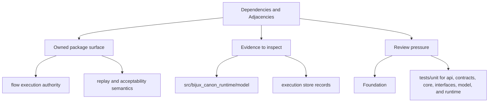

# Dependencies and Adjacencies

Package dependencies matter because they reveal which behavior is local and which behavior is delegated.

## Page Maps

## Direct Dependency Themes

- bijux-canon-agent
- bijux-canon-ingest
- bijux-canon-reason
- bijux-canon-index
- duckdb
- pydantic

## Adjacent Package Relationships

- governs the other canonical packages instead of replacing their local ownership
- is the final authority for run acceptance, replay evaluation, and stored evidence

## What This Page Answers

- what bijux-canon-runtime is expected to own
- what remains outside the package boundary
- which neighboring seams a reviewer should compare next

## Purpose

This page explains which surrounding tools and packages `bijux-canon-runtime` depends on to do its job.

## Stability

Keep it aligned with `pyproject.toml` and the actual package seams.
