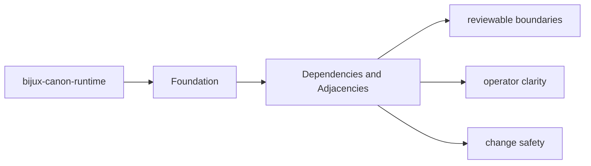
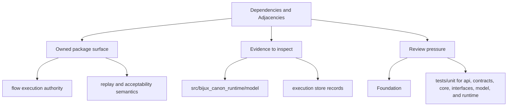

# Dependencies and Adjacencies

Package dependencies matter because they reveal which behavior is local and which behavior is delegated.

## Page Maps

## Direct Dependency Themes

- bijux-canon-agent
- bijux-canon-ingest
- bijux-canon-reason
- bijux-canon-index
- duckdb
- pydantic

## Adjacent Package Relationships

- governs the other canonical packages instead of replacing their local ownership
- is the final authority for run acceptance, replay evaluation, and stored evidence

## Concrete Anchors

- `packages/bijux-canon-runtime` as the package root
- `packages/bijux-canon-runtime/src/bijux_canon_runtime` as the import boundary
- `packages/bijux-canon-runtime/tests` as the package proof surface

## Use This Page When

- you need the package boundary before reading implementation detail
- you are deciding whether work belongs in this package or a neighboring one
- you need the shortest stable description of package intent

## What This Page Answers

- what bijux-canon-runtime is expected to own
- what remains outside the package boundary
- which neighboring seams a reviewer should compare next

## Reviewer Lens

- compare the stated package boundary with the owned modules and tests
- check that out-of-scope work is not quietly reintroduced through adjacent packages
- confirm that the package description still matches the real repository layout

## Honesty Boundary

This page can explain the intended boundary of bijux-canon-runtime, but it does not replace the code and tests that ultimately prove that boundary.

## Purpose

This page explains which surrounding tools and packages `bijux-canon-runtime` depends on to do its job.

## Stability

Keep it aligned with `pyproject.toml` and the actual package seams.

## Core Claim

The foundational claim of `bijux-canon-runtime` is that its package boundary can be explained in stable ownership terms instead of by implementation accident.

## Why It Matters

If the foundation pages for `bijux-canon-runtime` are weak, reviewers stop knowing where the package boundary really is and adjacent packages begin absorbing behavior by convenience instead of design.
