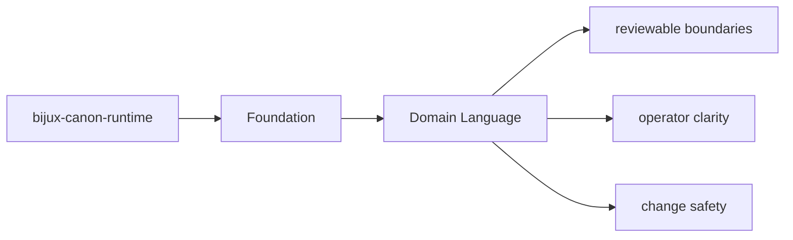
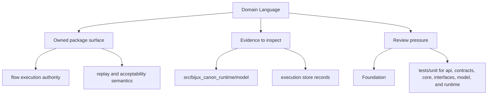

# Domain Language

The package should use language that reflects its actual ownership instead of borrowing
vague names from neighboring packages.

## Page Maps

## Package Vocabulary Anchors

- package name: `bijux-canon-runtime`
- Python import root: `bijux_canon_runtime`
- owning package directory: `packages/bijux-canon-runtime`
- key outputs: execution store records, replay decision artifacts, non-determinism policy evaluations

## What This Page Answers

- what bijux-canon-runtime is expected to own
- what remains outside the package boundary
- which neighboring seams a reviewer should compare next

## Purpose

This page records the naming anchors that should stay stable in docs, code, and review discussions.

## Stability

Keep it aligned with the package's real import names, directories, and artifact nouns.
