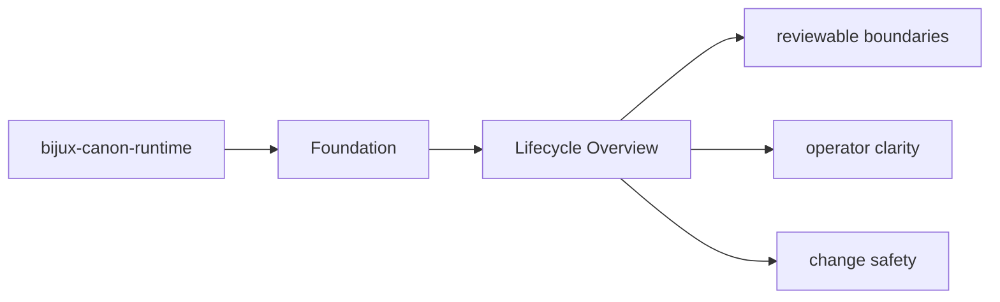

# Lifecycle Overview

Every package run follows a simple lifecycle: inputs enter through interfaces, domain and
application code coordinate the work, and durable artifacts or responses leave the package.

## Page Maps

## Lifecycle Anchors

- entry surfaces: CLI entrypoint in src/bijux_canon_runtime/interfaces/cli/entrypoint.py, HTTP app in src/bijux_canon_runtime/api/v1, schema files in apis/bijux-canon-runtime/v1
- code ownership: src/bijux_canon_runtime/model, src/bijux_canon_runtime/runtime, src/bijux_canon_runtime/application
- durable outputs: execution store records, replay decision artifacts, non-determinism policy evaluations

## Purpose

This page keeps the package lifecycle readable before a reader dives into implementation detail.

## Stability

Keep it aligned with the current entrypoints and produced outputs.
