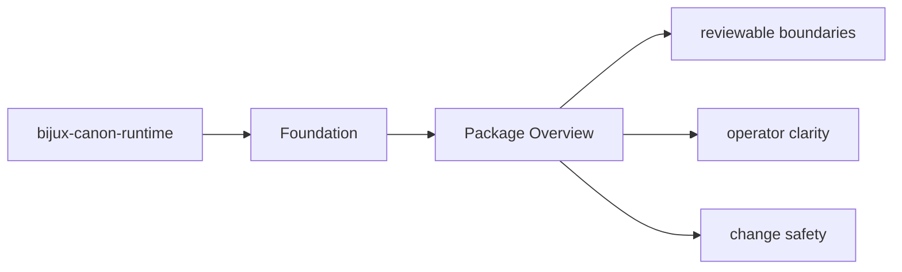

# Package Overview

`bijux-canon-runtime` is the package that owns governed execution and replay authority with auditable non-determinism handling, persistence, and package-to-package coordination.

## Page Maps

## What It Owns

- flow execution authority
- replay and acceptability semantics
- trace capture, runtime persistence, and execution-store behavior
- package-local CLI and API boundaries

## What It Does Not Own

- agent composition policy
- ingest and index domain ownership
- repository tooling and release support

## Purpose

This page gives the shortest honest description of what the package is for.

## Stability

Keep it aligned with the real package boundary described by the code and tests.
