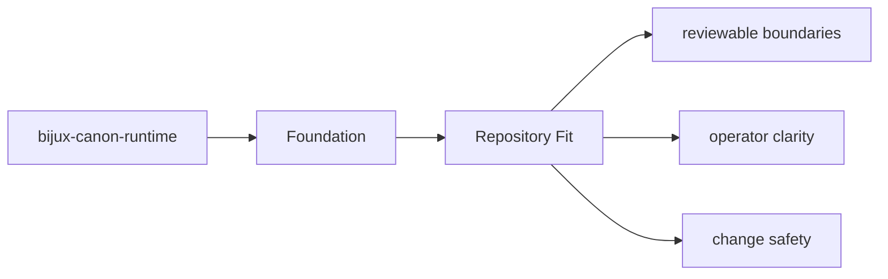

# Repository Fit

`bijux-canon-runtime` sits inside the monorepo as one publishable package with its own `src/`,
tests, metadata, and release history.

## Page Maps

## Repository Relationships

- governs the other canonical packages instead of replacing their local ownership
- is the final authority for run acceptance, replay evaluation, and stored evidence

## Canonical Package Root

- `packages/bijux-canon-runtime`
- `packages/bijux-canon-runtime/src/bijux_canon_runtime`
- `packages/bijux-canon-runtime/tests`

## Purpose

This page explains how the package fits into the repository without restating repository-wide rules.

## Stability

Keep it aligned with the package's checked-in directories and actual neighboring packages.
