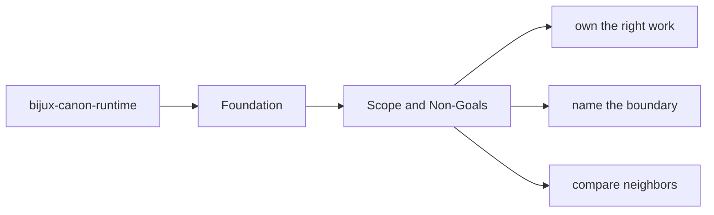
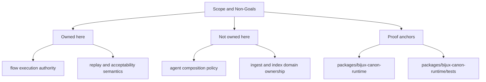

# Scope and Non-Goals

This page names the line that keeps `bijux-canon-runtime` useful instead of bloated.
The point of a package boundary is not to make work harder. It is to keep
neighboring packages from silently accumulating overlapping authority.

The non-goals matter as much as the goals. A package becomes easier to trust
when readers can see what it refuses to absorb just because the code happens to
be nearby.

Read the foundation pages for `bijux-canon-runtime` as the package's durable self-description. They should let a reader understand the package without needing to reconstruct its purpose from recent implementation history.

## Page Maps

## In Scope

- flow execution authority
- replay and acceptability semantics
- trace capture, runtime persistence, and execution-store behavior
- package-local CLI and API boundaries

## Out of Scope

- agent composition policy
- ingest and index domain ownership
- repository tooling and release support

## Concrete Anchors

- `packages/bijux-canon-runtime` as the package root
- `packages/bijux-canon-runtime/src/bijux_canon_runtime` as the import boundary
- `packages/bijux-canon-runtime/tests` as the package proof surface

## Use This Page When

- you need the package idea before the implementation detail
- you are deciding whether work belongs here or in a neighboring package
- you want the shortest honest explanation of what this package is for

## Decision Rule

Use `Scope and Non-Goals` to decide whether a change makes `bijux-canon-runtime` easier or harder to defend as one distinct role in the overall system. If the work makes the package broader without making its role clearer, stop and re-check the boundary before treating the change as a local improvement.

## Next Checks

- move to architecture when the question becomes structural rather than boundary-oriented
- move to interfaces when the question becomes contract-facing
- move to quality when the question becomes proof or review sufficiency

## Update This Page When

- package ownership moves between this package and a neighboring one
- the package description, core outputs, or boundary modules materially change
- tests or docs reveal that the old boundary explanation is no longer accurate

## What This Page Answers

- what problem `bijux-canon-runtime` is supposed to own on purpose
- where the package boundary stops, even when nearby code looks tempting
- which neighboring package seams deserve comparison before the boundary is changed

## Reviewer Lens

- compare the stated boundary with the modules, artifacts, and tests that are supposed to uphold it
- check that out-of-scope behavior is not quietly re-entering through convenience paths
- confirm that the package story still matches the real repository layout and neighboring package docs

## Honesty Boundary

This page can explain the intended boundary of `bijux-canon-runtime`, but it cannot prove that boundary by itself. The real proof still lives in the code, tests, and neighboring package seams that either support or contradict the story told here.

## Purpose

This page keeps future work from leaking into the wrong package.

## Stability

Update it only when ownership truly moves into or out of `bijux-canon-runtime`.

## What Good Looks Like

Use these points as the fast check for whether the page is doing real explanatory work.

- `Scope and Non-Goals` leaves a reviewer able to explain `bijux-canon-runtime` in one clean sentence without hand-waving
- the owned and out-of-scope areas make the package feel narrower and more intentional, not more defensive
- neighboring packages become easier to place because this package feels like one clear role in a larger flow

## Failure Signals

These are the quickest signs that the page is drifting from honest explanation into noise or stale certainty.

- `Scope and Non-Goals` needs repeated exceptions before the package role makes sense
- the out-of-scope list starts sounding like shadow ownership instead of a real boundary
- review conversations fall back to file proximity instead of package intent

## Tradeoffs To Hold

A strong page names the tensions it is managing instead of pretending every desirable goal improves together.

- prefer clean ownership over local convenience, even when nearby code looks easier to reuse
- prefer an explicit boundary gap over a shadow responsibility that no package clearly owns
- prefer keeping `bijux-canon-runtime` intelligible as one clear role in the system over making it look universally useful

## Cross Implications

- changes here influence how neighboring packages are allowed to stay narrow around `bijux-canon-runtime`
- a weak foundation story makes architecture, interface, operations, and quality pages feel like disconnected fragments
- if ownership is unclear here, the rest of the handbook has to waste time repairing that confusion

## Approval Questions

A reviewer should be able to answer these clearly before trusting the page or the change it is helping to explain.

- does `Scope and Non-Goals` still let a reviewer state `bijux-canon-runtime` ownership in one clear sentence
- does the change preserve package boundaries without creating shadow scope in a neighbor
- is there concrete code and test evidence behind the boundary claim, or only persuasive prose

## Evidence Checklist

Check these assets before trusting the prose. They are the concrete places where the page either holds up or falls apart.

- read the owned module roots under `packages/bijux-canon-runtime/src/bijux_canon_runtime` with the boundary statement in mind
- inspect `packages/bijux-canon-runtime/tests` for proof that the boundary is enforced instead of merely described
- check whether adjacent package docs now tell a conflicting ownership story

## Anti-Patterns

These patterns make documentation feel fuller while quietly making it less clear, less honest, or less durable.

- using package adjacency as a substitute for package ownership
- letting boundary exceptions accumulate until they become the real rule
- writing boundary prose that cannot be checked against code or tests

## Escalate When

These conditions mean the problem is larger than a local wording fix and needs a wider review conversation.

- the page can no longer explain ownership without repeated cross-package caveats
- a change proposal would shift authority between packages rather than stay local
- tests and docs disagree on who is supposed to own the behavior

## Core Claim

The core foundational claim of `bijux-canon-runtime` is that its ownership can be explained as a deliberate package boundary, not as an accident of where code happened to accumulate.

## Why It Matters

If the foundation pages for `bijux-canon-runtime` are weak, reviewers stop knowing where the package really begins and ends. Adjacent packages then absorb behavior by convenience instead of by design.

## If It Drifts

- ownership starts migrating by convenience instead of by explicit package boundary
- neighboring packages inherit responsibilities without deliberate review
- reviewers lose confidence that the package description still means anything stable

## Representative Scenario

A contributor proposes moving new behavior into `bijux-canon-runtime` because it looks nearby or related. This page should make it obvious whether that work actually belongs to this package role or whether the overall system becomes clearer if the work lands somewhere else.

## Source Of Truth Order

- `packages/bijux-canon-runtime/src/bijux_canon_runtime` for the real ownership boundary in code
- `packages/bijux-canon-runtime/tests` for executable proof that the boundary still holds under change
- `packages/bijux-canon-runtime/README.md` plus this section for the shortest maintained explanation of why that boundary exists

## Common Misreadings

- that `bijux-canon-runtime` owns any nearby behavior just because it would be convenient
- that a boundary statement is enough even when code and tests tell a different story
- that out-of-scope means unimportant rather than intentionally owned elsewhere
