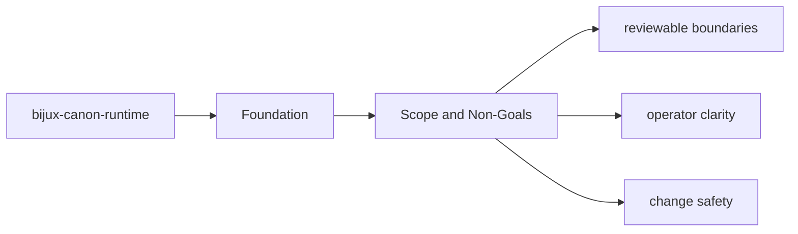
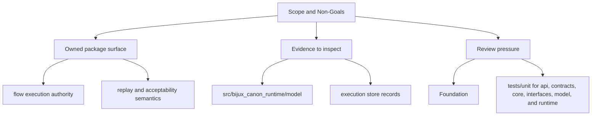

# Scope and Non-Goals

The package boundary exists so neighboring packages can evolve without hidden overlap.

## Page Maps

## In Scope

- flow execution authority
- replay and acceptability semantics
- trace capture, runtime persistence, and execution-store behavior
- package-local CLI and API boundaries

## Out of Scope

- agent composition policy
- ingest and index domain ownership
- repository tooling and release support

## Purpose

This page keeps future work from leaking into the wrong package.

## Stability

Update it only when ownership truly moves into or out of `bijux-canon-runtime`.
