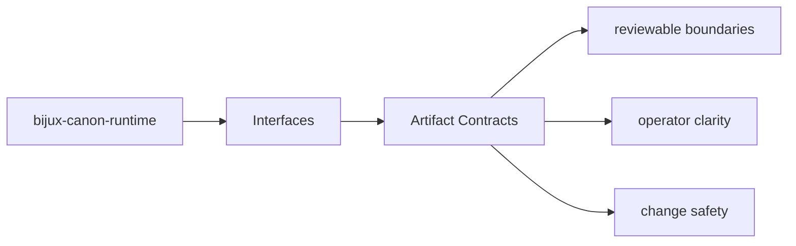

# Artifact Contracts

Produced artifacts are part of the package contract whenever another package, operator,
or replay workflow depends on them.

## Page Maps

## Current Artifacts

- execution store records
- replay decision artifacts
- non-determinism policy evaluations

## Purpose

This page marks which outputs need stable review when behavior changes.

## Stability

Keep it aligned with the package outputs that are actually produced and consumed.
