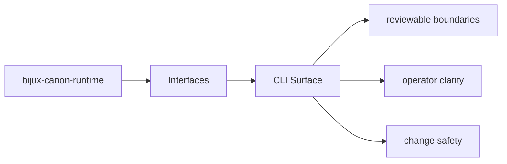

# CLI Surface

The CLI surface is the operator-facing command layer for `bijux-canon-runtime`.

## Page Maps

## Command Facts

- canonical command: `bijux-canon-runtime`
- interface modules: CLI entrypoint in src/bijux_canon_runtime/interfaces/cli/entrypoint.py, HTTP app in src/bijux_canon_runtime/api/v1, schema files in apis/bijux-canon-runtime/v1

## Purpose

This page points maintainers toward the command entrypoints and their owning code.

## Stability

Keep it aligned with the declared scripts and the interface modules that implement them.
