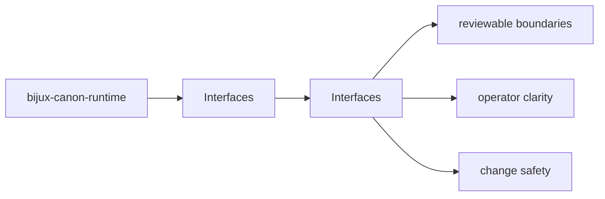
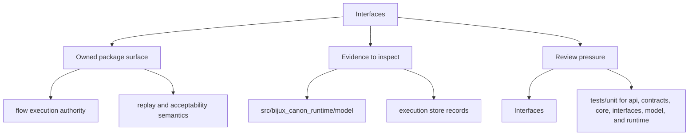

# Interfaces

bijux-canon-runtime interface pages describe the command, API, configuration, import, and artifact surfaces that a caller can rely on.

## Page Maps

## Pages in This Section

- [CLI Surface](cli-surface.md)
- [API Surface](api-surface.md)
- [Configuration Surface](configuration-surface.md)
- [Data Contracts](data-contracts.md)
- [Artifact Contracts](artifact-contracts.md)
- [Entrypoints and Examples](entrypoints-and-examples.md)
- [Operator Workflows](operator-workflows.md)
- [Public Imports](public-imports.md)
- [Compatibility Commitments](compatibility-commitments.md)

## Read Across the Package

- [Foundation](../foundation/index.md)
- [Architecture](../architecture/index.md)
- [Operations](../operations/index.md)
- [Quality](../quality/index.md)

## Concrete Anchors

- CLI entrypoint in src/bijux_canon_runtime/interfaces/cli/entrypoint.py
- HTTP app in src/bijux_canon_runtime/api/v1
- schema files in apis/bijux-canon-runtime/v1
- apis/bijux-canon-runtime/v1/schema.yaml

## Use This Page When

- you need the public command, API, import, or artifact surface
- you are checking whether a caller can rely on a given shape or entrypoint
- you need the contract-facing side of the package before using it

## What This Page Answers

- which public or operator-facing surfaces bijux-canon-runtime exposes
- which artifacts and schemas act like contracts
- what compatibility pressure this surface creates

## Reviewer Lens

- compare commands, API files, imports, and artifacts against the documented surface
- check whether schema or artifact changes need compatibility review
- confirm that operator-facing examples still point at real entrypoints

## Honesty Boundary

This page can identify the intended public surfaces of bijux-canon-runtime, but real compatibility still depends on code, schemas, artifacts, and tests staying aligned.

## Section Contract

- define what the interfaces section covers for bijux-canon-runtime
- point readers to the topic pages that hold the detailed explanations
- keep the section boundary reviewable as the package evolves

## Reading Advice

- start here when you know the package but not yet the right page inside the section
- use the page list to choose the narrowest topic that matches the current question
- move across sections only after this section stops being the right lens

## Purpose

This page explains how to use the interfaces section for `bijux-canon-runtime` without repeating the detail that belongs on the topic pages beneath it.

## Stability

This page is part of the canonical package docs spine. Keep it aligned with the current package boundary and the topic pages in this section.

## Core Claim

The interface claim of `bijux-canon-runtime` is that commands, APIs, imports, schemas, and artifacts form a reviewable contract rather than an implied one.
