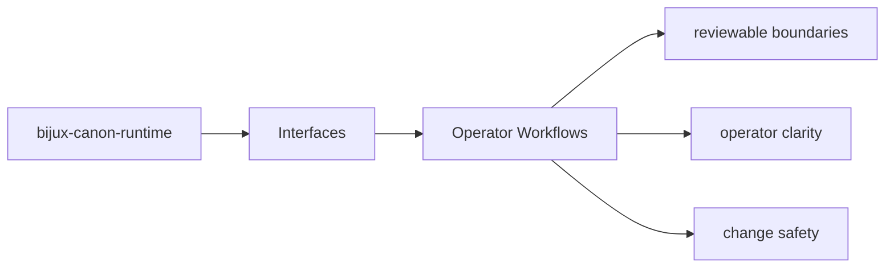
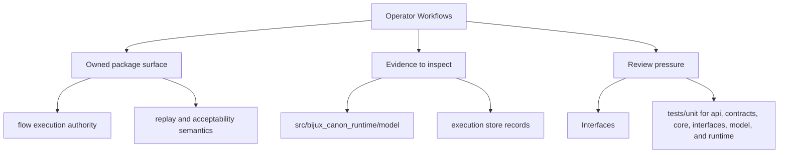

# Operator Workflows

Operator workflows should start from documented package entrypoints and end in reviewable outputs.

## Page Maps

## Workflow Anchors

- entry surfaces: CLI entrypoint in src/bijux_canon_runtime/interfaces/cli/entrypoint.py, HTTP app in src/bijux_canon_runtime/api/v1, schema files in apis/bijux-canon-runtime/v1
- durable outputs: execution store records, replay decision artifacts, non-determinism policy evaluations
- validation backstops: tests/unit for api, contracts, core, interfaces, model, and runtime, tests/e2e for governed flow behavior

## What This Page Answers

- which public or operator-facing surfaces bijux-canon-runtime exposes
- which artifacts and schemas act like contracts
- what compatibility pressure this surface creates

## Purpose

This page connects package interfaces to the workflows an operator actually performs.

## Stability

Keep it aligned with the existing commands, endpoints, and outputs.
