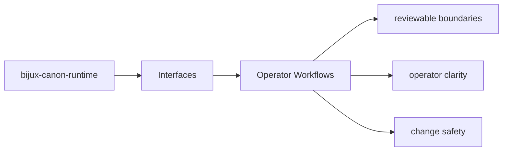
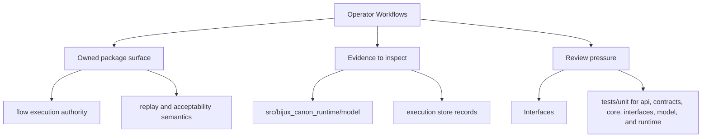

# Operator Workflows

Operator workflows should start from documented package entrypoints and end in reviewable outputs.

This page connects interface prose to real use. A reader should leave with a
picture of how commands, APIs, inputs, and outputs hang together in a workflow
an operator can actually repeat.

Read the interfaces pages for `bijux-canon-runtime` as the bridge between implementation and caller expectation. They should tell a reader what the package is prepared to stand behind before a downstream dependency forms.

## Page Maps

## Workflow Anchors

- entry surfaces: CLI entrypoint in src/bijux_canon_runtime/interfaces/cli/entrypoint.py, HTTP app in src/bijux_canon_runtime/api/v1, schema files in apis/bijux-canon-runtime/v1
- durable outputs: execution store records, replay decision artifacts, non-determinism policy evaluations
- validation backstops: tests/unit for api, contracts, core, interfaces, model, and runtime, tests/e2e for governed flow behavior

## Concrete Anchors

- CLI entrypoint in src/bijux_canon_runtime/interfaces/cli/entrypoint.py
- HTTP app in src/bijux_canon_runtime/api/v1
- schema files in apis/bijux-canon-runtime/v1
- apis/bijux-canon-runtime/v1/schema.yaml

## Use This Page When

- you need the public command, API, import, schema, or artifact surface
- you are checking whether a caller can safely rely on a given entrypoint or shape
- you want the contract-facing side of the package before building on it

## Decision Rule

Use `Operator Workflows` to decide whether a caller-facing surface is explicit enough to depend on. If the surface cannot be tied back to concrete code, schemas, artifacts, examples, and tests, treat it as unstable until that evidence is visible.

## Next Checks

- move to operations when the caller-facing question becomes procedural or environmental
- move to quality when compatibility or evidence of protection becomes the real issue
- move back to architecture when a public-surface question reveals a deeper structural drift

## Update This Page When

- commands, schemas, API modules, imports, or artifacts change in a caller-visible way
- compatibility expectations change or a new contract surface appears
- examples or entrypoints stop matching the actual package boundary

## What This Page Answers

- which public or operator-facing surfaces `bijux-canon-runtime` is really asking readers to trust
- which schemas, artifacts, imports, or commands behave like contracts
- what compatibility pressure a change to this surface would create

## Reviewer Lens

- compare commands, schemas, imports, and artifacts against the documented surface one by one
- check whether a seemingly local change actually needs compatibility review
- confirm that examples still point to real entrypoints and not to stale habits

## Honesty Boundary

This page can identify the intended public surfaces of `bijux-canon-runtime`, but real compatibility depends on code, schemas, artifacts, examples, and tests staying aligned. If those disagree, the prose is wrong or incomplete.

## Purpose

This page connects package interfaces to the workflows an operator actually performs.

## Stability

Keep it aligned with the existing commands, endpoints, and outputs.

## What Good Looks Like

- `Operator Workflows` leaves a caller knowing which surfaces are explicit enough to trust
- the contract discussion ties together commands, schemas, artifacts, and tests instead of treating them separately
- compatibility review becomes a visible step rather than an afterthought

## Failure Signals

- `Operator Workflows` names surfaces that cannot be matched to real code, schemas, or artifacts
- callers have to infer stability from examples instead of from explicit contract evidence
- compatibility review starts after change has already landed instead of before

## Tradeoffs To Hold

- prefer a smaller explicit contract over a wider surface whose stability has to be guessed
- prefer paying compatibility-review cost up front over discovering caller breakage after release
- prefer contract evidence that is slightly heavier to maintain over allowing `bijux-canon-runtime` surfaces to drift silently

## Cross Implications

- changes here shape what downstream packages and operators can safely assume about `bijux-canon-runtime`
- operations and quality pages become stale quickly if contract surfaces move silently
- architectural seams need review whenever a new public surface appears for convenience

## Approval Questions

- does `Operator Workflows` name only caller-facing surfaces that have explicit contract evidence
- would a downstream consumer understand the compatibility expectations before depending on the surface
- are code, schemas, artifacts, examples, and tests still telling the same contract story

## Evidence Checklist

- inspect the implemented interface modules under `packages/bijux-canon-runtime/src/bijux_canon_runtime`
- review `apis/bijux-canon-runtime/v1/schema.yaml` as tracked contract evidence
- run through `packages/bijux-canon-runtime/tests` or equivalent proofs that protect the surface

## Anti-Patterns

- treating convenience surfaces as if they were deliberate contracts
- changing schemas or artifacts without a caller-facing compatibility discussion
- using examples to imply stability that code and tests do not actually promise

## Escalate When

- a supposedly local change alters a caller-visible schema, artifact, import, or command contract
- compatibility risk extends beyond one implementation file
- operators or downstream packages would need to relearn the surface after the change

## Core Claim

The core interface claim of `bijux-canon-runtime` is that commands, APIs, imports, schemas, and artifacts form a reviewable contract rather than a set of implied habits.

## Why It Matters

If the interface pages for `bijux-canon-runtime` are weak, callers cannot tell which surfaces are stable enough to depend on. Compatibility review then arrives after people have already built on the wrong assumptions.

## If It Drifts

- callers depend on surfaces that are less stable than the docs imply
- schema and artifact changes stop receiving the compatibility review they need
- operator examples begin pointing at stale or misleading entrypaths

## Representative Scenario

An operator or downstream caller wants to depend on a `bijux-canon-runtime` surface and needs to know which command, API, schema, import, or artifact is stable enough to treat as a contract.

## Source Of Truth Order

- `packages/bijux-canon-runtime/src/bijux_canon_runtime` for the implemented interface boundary
- `apis/bijux-canon-runtime/v1/schema.yaml` as tracked contract evidence for caller-facing behavior
- `packages/bijux-canon-runtime/tests` for compatibility and behavior proof

## Common Misreadings

- that every visible package surface is equally stable
- that one schema file or example captures the whole compatibility story
- that interface prose overrides code, artifacts, or tests when they disagree
