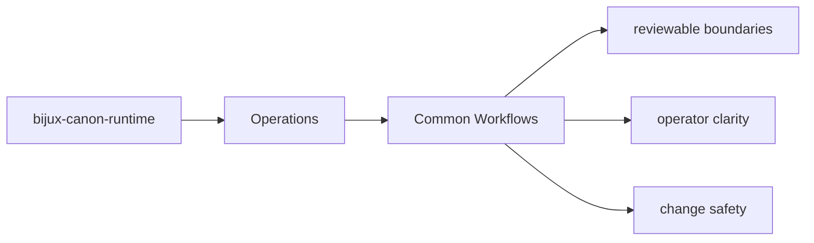

# Common Workflows

Most work on `bijux-canon-runtime` follows one of a few recurring paths.

## Page Maps

## Recurring Paths

- inspect the package README and section indexes first
- follow an interface into the owning module group
- run the owning tests before declaring the change complete

## Code Areas

- `src/bijux_canon_runtime/model` for durable runtime models
- `src/bijux_canon_runtime/runtime` for execution engines and lifecycle logic
- `src/bijux_canon_runtime/application` for orchestration and replay coordination
- `src/bijux_canon_runtime/verification` for runtime-level validation support
- `src/bijux_canon_runtime/interfaces` for CLI surfaces and manifest loading
- `src/bijux_canon_runtime/api` for HTTP application surfaces

## Purpose

This page makes common package workflows easier to repeat consistently.

## Stability

Keep it aligned with the actual package structure and tests.
