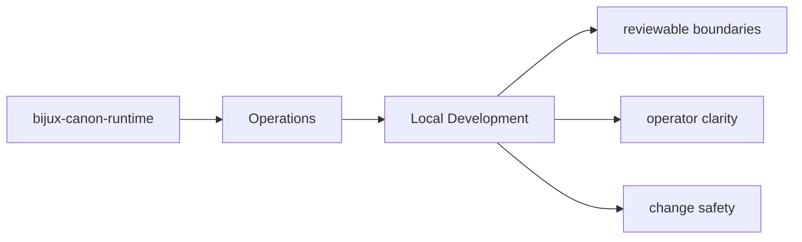
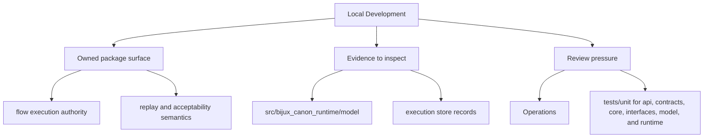

# Local Development

Local development should happen inside `packages/bijux-canon-runtime` with tests and docs updated
in the same change series as the code.

## Page Maps

## Development Anchors

- tests/unit for api, contracts, core, interfaces, model, and runtime
- tests/e2e for governed flow behavior
- tests/regression and tests/smoke for replay and storage protection
- tests/golden for durable example fixtures

## Use This Page When

- you are installing, running, diagnosing, or releasing the package
- you need operational anchors rather than conceptual framing
- you are responding to package behavior in a local or CI environment

## What This Page Answers

- how bijux-canon-runtime is installed, run, diagnosed, and released
- which files or tests matter during package operation
- where an operator should look when behavior changes

## Reviewer Lens

- verify that setup, workflow, and release references still match package metadata
- check that operational docs point at current diagnostics and validation paths
- confirm that release-facing claims match the package's actual versioning files

## Honesty Boundary

This page explains how bijux-canon-runtime is expected to be operated, but it does not replace package metadata, runtime behavior, or validation runs in a real environment.

## Purpose

This page records the package-local development posture.

## Stability

Keep it aligned with the actual test layout and maintenance workflow.
