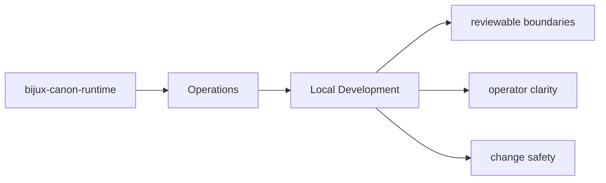

# Local Development

Local development should happen inside `packages/bijux-canon-runtime` with tests and docs updated
in the same change series as the code.

## Page Maps

## Development Anchors

- tests/unit for api, contracts, core, interfaces, model, and runtime
- tests/e2e for governed flow behavior
- tests/regression and tests/smoke for replay and storage protection
- tests/golden for durable example fixtures

## Purpose

This page records the package-local development posture.

## Stability

Keep it aligned with the actual test layout and maintenance workflow.
