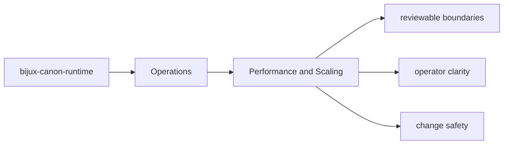

# Performance and Scaling

Performance work should preserve the deterministic and contract-driven behavior the package already promises.

## Page Maps

## Performance Review Anchors

- inspect workflow modules before optimizing boundary code blindly
- use the package tests that exercise realistic workloads
- treat artifact and contract drift as a regression even when performance improves

## Test Anchors

- tests/unit for api, contracts, core, interfaces, model, and runtime
- tests/e2e for governed flow behavior
- tests/regression and tests/smoke for replay and storage protection
- tests/golden for durable example fixtures

## Purpose

This page records the posture for performance work in `bijux-canon-runtime`.

## Stability

Keep it aligned with the package's actual performance-sensitive paths and validation surfaces.
