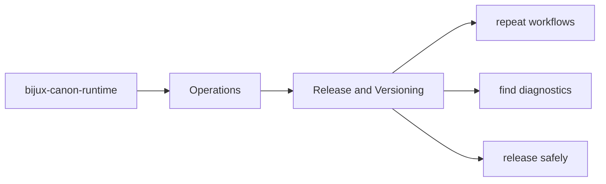
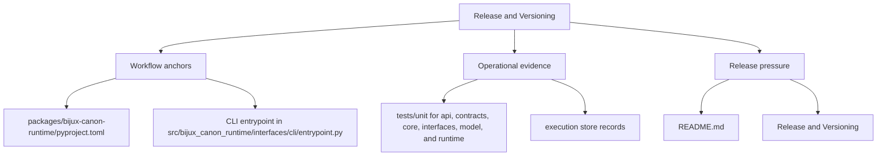

# Release and Versioning

Release work for `bijux-canon-runtime` depends on package metadata, tracked release notes, and
the repository's commit conventions.

The release path is part of the product story because it determines how readers
learn what changed and what stayed stable. This page should make package-local
release mechanics understandable without separating them from repository rules.

Read the operations pages for `bijux-canon-runtime` as the package's explicit operating memory. They should make common tasks repeatable without forcing maintainers to relearn the workflow from code, CI logs, or oral history.

## Page Maps

## Release Anchors

- README.md
- CHANGELOG.md
- pyproject.toml

## Versioning Anchors

- version file: `packages/bijux-canon-runtime/src/bijux_canon_runtime/_version.py`
- tag pattern is configured in `packages/bijux-canon-runtime/pyproject.toml`

## Concrete Anchors

- `packages/bijux-canon-runtime/pyproject.toml` for package metadata
- `packages/bijux-canon-runtime/README.md` for local package framing
- `packages/bijux-canon-runtime/tests` for executable operational backstops

## Use This Page When

- you are installing, running, diagnosing, or releasing the package
- you need repeatable operational anchors rather than architectural framing
- you are responding to package behavior in local work, CI, or incident pressure

## Decision Rule

Use `Release and Versioning` to decide whether a maintainer can repeat the package workflow from checked-in assets instead of memory. If a step works only because someone already knows the trick, the workflow is not documented clearly enough yet.

## What This Page Answers

- how `bijux-canon-runtime` is installed, run, diagnosed, and released in practice
- which checked-in files and tests anchor the operational story
- where a maintainer should look first when the package behaves differently

## Reviewer Lens

- verify that setup, workflow, and release statements still match package metadata and current commands
- check that operational guidance still points at real diagnostics and validation paths
- confirm that maintainer advice still works under current local and CI expectations

## Honesty Boundary

This page explains how `bijux-canon-runtime` is expected to be operated, but it does not replace package metadata, actual runtime behavior, or validation in a real environment. A workflow is only trustworthy if a maintainer can still repeat it from the checked-in assets named here.

## Next Checks

- move to interfaces when the operational path depends on a specific surface contract
- move to quality when the question becomes whether the workflow is sufficiently proven
- move back to architecture when operational complexity suggests a structural problem

## Purpose

This page ties package-local release mechanics to the wider repository release model.

## Stability

Keep it aligned with the package metadata and current versioning configuration.
