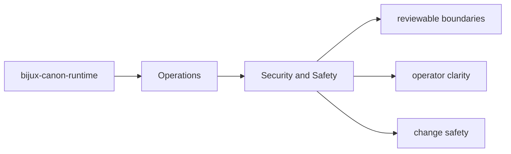
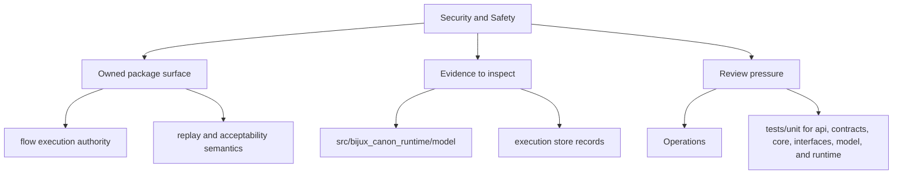

# Security and Safety

Security review in `bijux-canon-runtime` should focus on the package's real boundary surfaces and outputs.

## Page Maps

## Review Anchors

- CLI entrypoint in src/bijux_canon_runtime/interfaces/cli/entrypoint.py
- HTTP app in src/bijux_canon_runtime/api/v1
- schema files in apis/bijux-canon-runtime/v1

## Safety Rule

Any change that broadens package authority should update docs, tests, and release notes together.

## What This Page Answers

- how bijux-canon-runtime is installed, run, diagnosed, and released
- which files or tests matter during package operation
- where an operator should look when behavior changes

## Purpose

This page keeps security review grounded in concrete package seams.

## Stability

Keep it aligned with the package interfaces and operational risk profile.
