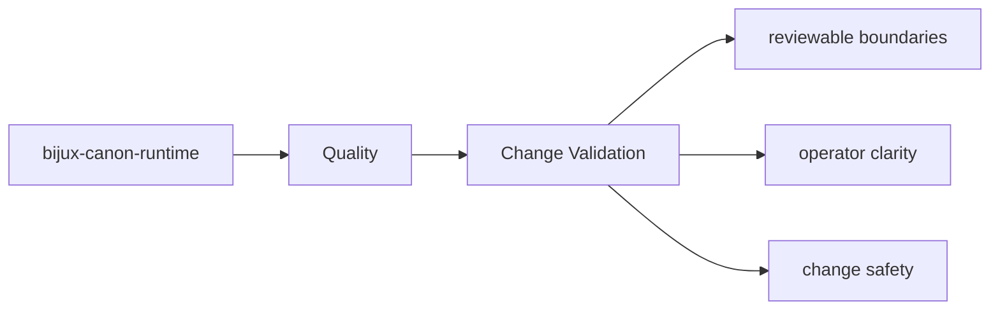
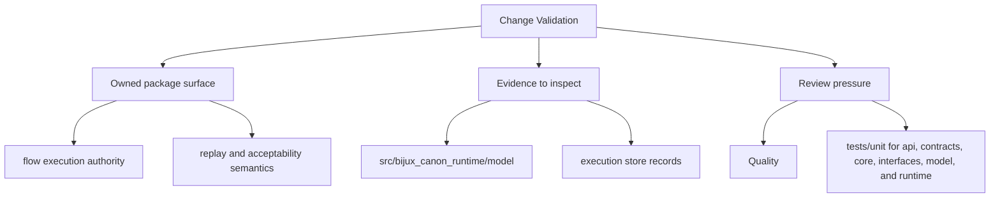

# Change Validation

Validation after a change should target the package surfaces that were actually touched.

Read the quality pages for `bijux-canon-runtime` as the proof frame around the package: they should explain how trust is earned, defended, and revised after change.

## Page Maps

## Validation Targets

- interface changes should update interface docs and owning tests
- artifact changes should update artifact docs and consuming tests
- architectural changes should update section pages that explain the package seam

## Test Anchors

- tests/unit for api, contracts, core, interfaces, model, and runtime
- tests/e2e for governed flow behavior
- tests/regression and tests/smoke for replay and storage protection
- tests/golden for durable example fixtures

## Concrete Anchors

- tests/unit for api, contracts, core, interfaces, model, and runtime
- tests/e2e for governed flow behavior
- README.md

## Use This Page When

- you are reviewing tests, invariants, limitations, or risk
- you need evidence that the documented contract is actually protected
- you are deciding whether a change is done rather than merely implemented

## Decision Rule

Use `Change Validation` to decide whether `bijux-canon-runtime` has actually earned trust after a change. If the package passes one narrow check but leaves the wider contract, risk, or validation story unclear, the correct answer is that the work is not done yet.

## Next Checks

- move to foundation when the risk appears to be boundary confusion rather than missing tests
- move to architecture when the proof gap points to structural drift
- move to interfaces or operations when the proof question is really about a contract or workflow

## Update This Page When

- test layout, invariant protection, or risk posture changes materially
- definition-of-done or validation practice changes in a way reviewers must understand
- known limitations or evidence expectations move with the codebase

## What This Page Answers

- what proves the bijux-canon-runtime contract today
- which risks or limits still need explicit review
- what a reviewer should verify before accepting change

## Reviewer Lens

- compare the documented proof strategy with the current test layout
- look for limitations or risks that should have been updated by recent changes
- verify that the page's definition of done still reflects real validation practice

## Honesty Boundary

This page explains how bijux-canon-runtime protects itself, but it does not claim that prose alone is enough without the listed tests, checks, and review practice.

## Purpose

This page records how to choose meaningful validation for package work.

## Stability

Keep it aligned with the package's current test layout and docs structure.

## What Good Looks Like

- `Change Validation` leaves a reviewer able to say why the package should be trusted after a change
- tests, limitations, and risk language reinforce one another instead of competing
- the completion bar is demanding enough to prevent shallow acceptance

## Failure Signals

- `Change Validation` says the package is protected but cannot show which proof closes which risk
- reviewers disagree on whether the work is done because the standard is too implicit
- limitations remain unchanged even when package behavior has obviously shifted

## Cross Implications

- changes here influence how all other `bijux-canon-runtime` sections should be trusted after modification
- foundation, architecture, interface, and operations claims all become weaker if proof expectations drift
- review discipline here determines whether neighboring sections remain explanatory or merely aspirational

## Evidence Checklist

- read `packages/bijux-canon-runtime/tests` with the page's proof claims in hand
- verify package metadata and release notes in `packages/bijux-canon-runtime` do not contradict the review standard
- check whether known limitations, risks, and completion language all moved together in the current change

## Anti-Patterns

- equating one local pass with full contract confidence
- keeping old risk prose after the code and tests have materially changed
- treating definition-of-done language as ceremonial rather than operational

## Escalate When

- the proof story can no longer be updated without revisiting adjacent sections
- a local validation gap reveals a larger boundary or architecture issue
- reviewers cannot agree on done-ness because the underlying contract changed

## Core Claim

The quality claim of `bijux-canon-runtime` is that tests, invariants, risks, and completion criteria jointly prove whether the package is trustworthy after change.

## Why It Matters

If the quality pages for `bijux-canon-runtime` are weak, it becomes difficult to tell whether a change is actually safe or merely passes a narrow local test.

## If It Drifts

- reviewers cannot tell whether the listed proof still covers the real risk surface
- limitations stop being visible until they show up as rework later
- definition-of-done language drifts away from actual validation practice

## Representative Scenario

A change appears correct locally, but the reviewer still needs to know whether `bijux-canon-runtime` has actually satisfied its proof obligations before the work is accepted.

## Source Of Truth Order

- `packages/bijux-canon-runtime/tests` for executable proof
- `packages/bijux-canon-runtime/pyproject.toml` for declared package constraints
- this page for the review lens that explains how to read that proof

## Common Misreadings

- that a passing local test automatically satisfies the package review standard
- that documented risks are static and do not need to move with the code
- that the definition of done is only about implementation rather than proof
