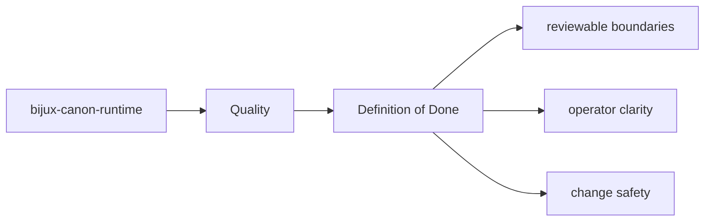
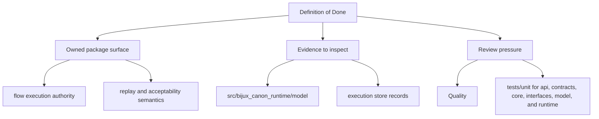

# Definition of Done

A change in `bijux-canon-runtime` is not done when code passes locally but the package contract
is still unclear or unprotected.

## Page Maps

## Done Means

- code, docs, and tests agree on the new behavior
- public surfaces and artifacts remain explainable
- release-facing impact is visible when compatibility changes

## What This Page Answers

- what proves the bijux-canon-runtime contract today
- which risks or limits still need explicit review
- what a reviewer should verify before accepting change

## Purpose

This page records the package's completion threshold.

## Stability

Keep it aligned with the package validation and release expectations.
