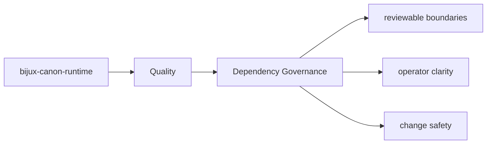

# Dependency Governance

Dependency changes in `bijux-canon-runtime` should be treated as contract changes when they
alter package authority, operational risk, or public setup expectations.

## Page Maps

## Current Dependency Themes

- bijux-canon-agent
- bijux-canon-ingest
- bijux-canon-reason
- bijux-canon-index
- duckdb
- pydantic

## Purpose

This page explains why dependency review matters for the package.

## Stability

Keep it aligned with `pyproject.toml` and the package's real dependency posture.
