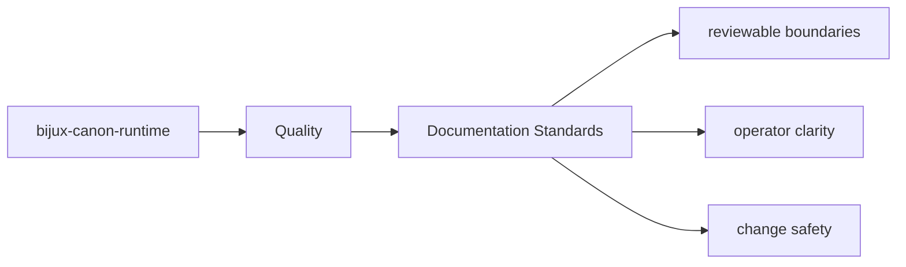

# Documentation Standards

Package docs should stay consistent with the shared handbook layout used across the repository.

## Page Maps

## Standards

- use the shared five-category package spine
- prefer stable filenames that describe durable intent
- keep docs grounded in real code paths, interfaces, and artifacts

## Purpose

This page keeps package docs from drifting back into ad hoc structure.

## Stability

Update it only when the shared documentation system itself changes.
