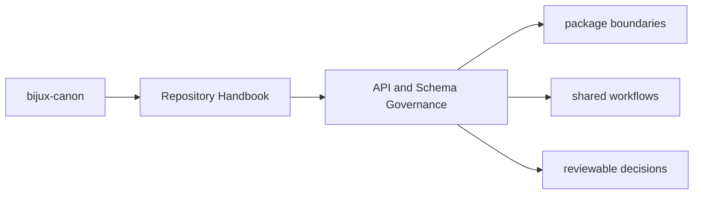
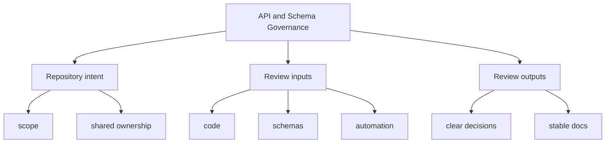

# API and Schema Governance

Shared API artifacts live under `apis/` so schema review does not depend on
reading package source alone. This repository currently tracks schemas for
ingest, index, reason, agent, and runtime.

## Page Maps

## Governance Rules

- package code and tracked schema files must describe the same public behavior
- drift checks belong in `bijux-canon-dev` or package tests, not in prose alone
- schema hashes and pinned OpenAPI artifacts should move only with reviewable intent

## Current Schema Roots

- `apis/bijux-canon-agent/v1`
- `apis/bijux-canon-index/v1`
- `apis/bijux-canon-ingest/v1`
- `apis/bijux-canon-reason/v1`
- `apis/bijux-canon-runtime/v1`

## Concrete Anchors

- `pyproject.toml` for workspace metadata and commit conventions
- `Makefile` and `makes/` for root automation
- `apis/` and `.github/workflows/` for schema and validation review

## Use This Page When

- you are dealing with repository-wide seams rather than one package alone
- you need shared workflow, schema, or governance context before changing code
- you want the monorepo view that sits above the package handbooks

## What This Page Answers

- which repository-level decision this page clarifies
- which shared assets or workflows a reviewer should inspect
- how the repository boundary differs from package-local ownership

## Reviewer Lens

- compare the page claims with the real root files, workflows, or schema assets
- check that repository guidance still stops where package ownership begins
- confirm that any repository rule described here is still enforceable in code or automation

## Honesty Boundary

These pages explain repository-level intent and shared rules, but they do not override package-local ownership or serve as evidence without the referenced files, workflows, and checks.

## Purpose

This page explains why schemas are first-class repository assets rather than incidental package outputs.

## Stability

Keep this page aligned with the actual schema directories and the validation tooling that protects them.

## Core Claim

Each repository handbook page should make one monorepo-level decision legible enough that package-local pages do not need to reinvent root context.

## Why It Matters

Repository pages matter because they keep shared rules, schemas, workflows, and release expectations from being rediscovered separately inside each package.

## If It Drifts

- root rules become folklore instead of checked-in reference
- packages start re-explaining shared repository behavior inconsistently
- reviewers lose the ability to separate monorepo policy from package-local design

## Representative Scenario

A cross-package change touches schemas, automation, and release behavior at once. The repository page should tell the reviewer which part of that decision belongs at the root and which part belongs back in package-local docs.

## Source Of Truth Order

- root files like `pyproject.toml`, `Makefile`, `makes/`, and `.github/workflows/` for actual repository behavior
- `apis/` for tracked shared schema artifacts
- this section for the explanation of how those assets fit together

## Common Misreadings

- that repository policy can be inferred safely from one package alone
- that root docs should silently absorb package-local details
- that repository guidance is authoritative without corresponding checked-in assets
