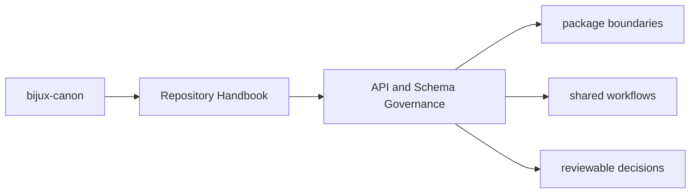

# API and Schema Governance

Shared API artifacts live under `apis/` so schema review does not depend on
reading package source alone. This repository currently tracks schemas for
ingest, index, reason, agent, and runtime.

## Page Maps

## Governance Rules

- package code and tracked schema files must describe the same public behavior
- drift checks belong in `bijux-canon-dev` or package tests, not in prose alone
- schema hashes and pinned OpenAPI artifacts should move only with reviewable intent

## Current Schema Roots

- `apis/bijux-canon-agent/v1`
- `apis/bijux-canon-index/v1`
- `apis/bijux-canon-ingest/v1`
- `apis/bijux-canon-reason/v1`
- `apis/bijux-canon-runtime/v1`

## Purpose

This page explains why schemas are first-class repository assets rather than incidental package outputs.

## Stability

Keep this page aligned with the actual schema directories and the validation tooling that protects them.
