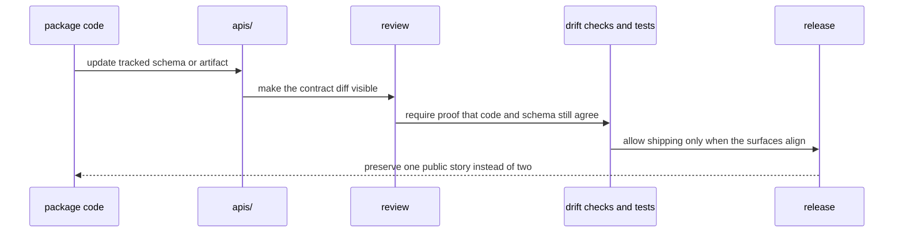

# API and Schema Governance

Shared API artifacts live under `apis/` so contract review does not depend on
reading package source alone. A caller or reviewer should not need to reverse-
engineer Python modules just to understand whether an HTTP or artifact
contract changed.

## How A Public Contract Change Should Move

## Governance Rules

- package code and tracked schema files must describe the same public behavior
- drift checks belong in `bijux-canon-dev` or package tests, not in prose alone
- schema hashes and pinned OpenAPI artifacts should move only with reviewable intent

## Current Schema Roots

- `apis/bijux-canon-agent/v1`
- `apis/bijux-canon-index/v1`
- `apis/bijux-canon-ingest/v1`
- `apis/bijux-canon-reason/v1`
- `apis/bijux-canon-runtime/v1`

One public contract should have one reviewable story. If code, schema files,
and release artifacts disagree, the docs are not the thing that will save us.
