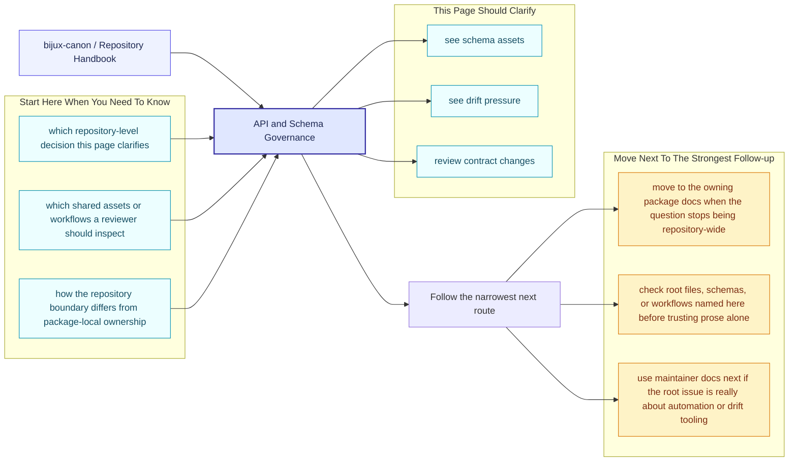
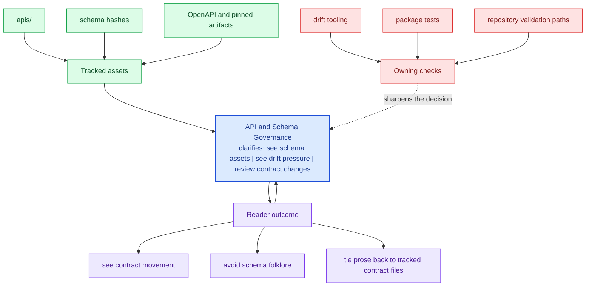

# API and Schema Governance

Shared API artifacts live under `apis/` so schema review does not depend on
reading package source alone. This repository currently tracks schemas for
ingest, index, reason, agent, and runtime.

That matters because the repository wants public surfaces to be reviewable in
the open. A caller or reviewer should not need to reverse-engineer Python
modules just to understand whether an HTTP or artifact contract changed.

These repository pages should explain the cross-package frame that no single package can explain alone. They are strongest when they make the monorepo easier to understand without turning the root into a second owner of package behavior.

## Page Maps

## Governance Rules

- package code and tracked schema files must describe the same public behavior
- drift checks belong in `bijux-canon-dev` or package tests, not in prose alone
- schema hashes and pinned OpenAPI artifacts should move only with reviewable intent

## Current Schema Roots

- `apis/bijux-canon-agent/v1`
- `apis/bijux-canon-index/v1`
- `apis/bijux-canon-ingest/v1`
- `apis/bijux-canon-reason/v1`
- `apis/bijux-canon-runtime/v1`

## Concrete Anchors

- `pyproject.toml` for workspace metadata and commit conventions
- `Makefile` and `makes/` for root automation
- `apis/` and `.github/workflows/` for schema and validation review

## Use This Page When

- you are dealing with repository-wide seams rather than one package alone
- you need shared workflow, schema, or governance context before changing code
- you want the monorepo view that sits above the package handbooks

## Decision Rule

Use `API and Schema Governance` to decide whether the current question is genuinely repository-wide or whether it belongs back in one package handbook. If the answer depends mostly on one package's local behavior, this page should redirect instead of absorbing detail that the package should own.

## What This Page Answers

- which repository-level decision this page clarifies
- which shared assets or workflows a reviewer should inspect
- how the repository boundary differs from package-local ownership

## Reviewer Lens

- compare the page claims with the real root files, workflows, or schema assets
- check that repository guidance still stops where package ownership begins
- confirm that any repository rule described here is still enforceable in code or automation

## Honesty Boundary

These pages explain repository-level intent and shared rules, but they do not override package-local ownership. They also do not count as proof by themselves; the real backstops are the referenced files, workflows, schemas, and checks.

## Next Checks

- move to the owning package docs when the question stops being repository-wide
- check root files, schemas, or workflows named here before trusting prose alone
- use maintainer docs next if the root issue is really about automation or drift tooling

## Purpose

This page explains why schemas are first-class repository assets rather than incidental package outputs.

## Stability

Keep this page aligned with the actual schema directories and the validation tooling that protects them.
