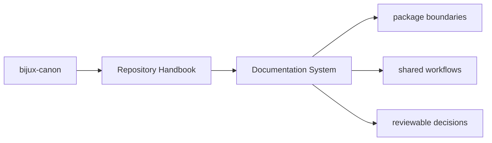

# Documentation System

The root documentation site is the canonical handbook for repository and
package behavior. It is intentionally structured like the reference documentation
in `bijux-pollenomics` and `bijux-masterclass`: one root index, section indexes,
and topic pages with stable names and repeated layout.

## Page Maps

## Documentation Rules

- use stable filenames that describe durable intent
- keep package handbooks on the same five-category spine
- separate product docs, maintainer docs, and legacy-compat docs
- update docs in the same change series that changes the underlying behavior

## Purpose

This page records the handbook system itself so the structure stays intentional instead of growing ad hoc again.

## Stability

Keep this page aligned with the actual docs tree and the layout rules enforced by this documentation catalog.
