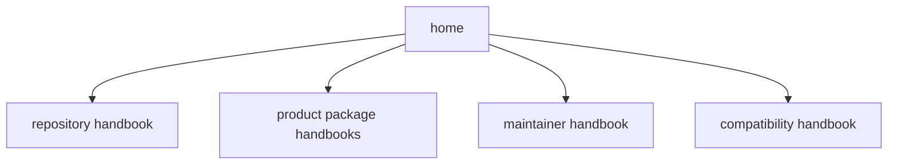

# Documentation System

The root handbook should be pleasant to read, not merely regular. The point is
clarity, not paperwork.

The root pages are intentionally hand-authored. They are meant for humans who
are trying to understand the whole system quickly. Developer-side tooling that
helps maintain docs belongs in `bijux-canon-dev`, not in a root `scripts/`
directory and not in the published reader experience.

## Handbook Shape

## What We Want From The Root Docs

- A new reader should be able to skim the root docs and understand the whole
  idea of `bijux-canon`.
- Diagrams should explain something real, not exist because a template expects
  a diagram.
- The root docs should reduce meeting debt instead of introducing another
  layer of documentation ceremony.

## What We Avoid

- root docs that read like generated compliance output
- legacy names leaking into the main handbook after the migration to
  `bijux-canon-*`
- developer tooling living at the root when it really belongs in
  `bijux-canon-dev`

The handbook should feel like part of the wider Bijux docs family without
losing the specific shape of this repository.
