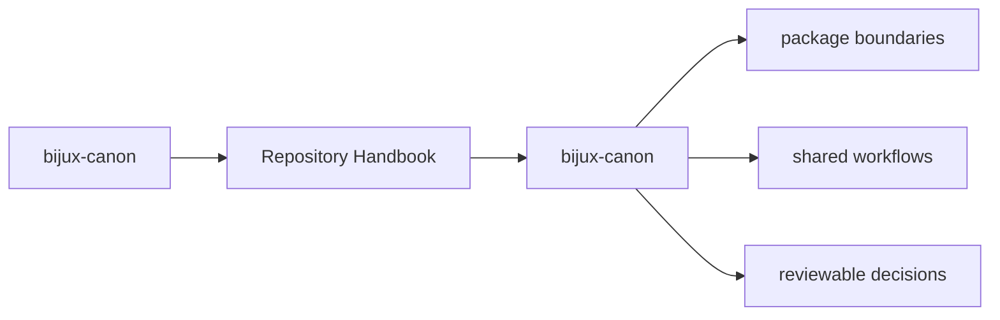
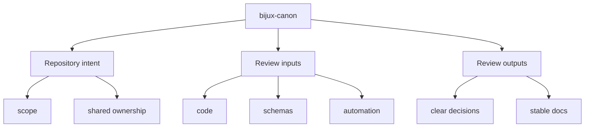

# bijux-canon

The repository handbook explains the shared story above the package level:
why this repository is split, which rules genuinely live at the root, and
how the packages stay coordinated without collapsing back into one blurry
codebase.

`bijux-canon` is easiest to understand if you start from intent instead of
from filenames. The repository exists to keep several deterministic,
reviewable surfaces moving together: ingest prepares evidence, index makes
retrieval executable, reason makes claims inspectable, agent turns role-based
work into orchestrated runs, and runtime decides what execution and replay
results are acceptable.

The repository is therefore less like a toolbox and more like a chain of
accountable boundaries. Each package is meant to carry one kind of promise
clearly enough that readers do not have to reverse-engineer the whole tree to
understand where authority lives.

<strong>The root is a coordination layer, not a shadow owner.</strong>
Product behavior should stay inside the publishable packages under `packages/`.
The root only owns what is genuinely shared: workspace layout, schema
governance, documentation rules, validation posture, and release
coordination.

These repository pages should explain the cross-package frame that no single package can explain alone. They are strongest when they make the monorepo easier to understand without turning the root into a second owner of package behavior.

## Page Maps

## Pages in This Section

- [Platform Overview](platform-overview.md)
- [Repository Scope](repository-scope.md)
- [Workspace Layout](workspace-layout.md)
- [Package Map](package-map.md)
- [API and Schema Governance](api-and-schema-governance.md)
- [Local Development](local-development.md)
- [Testing and Validation](testing-and-validation.md)
- [Release and Versioning](release-and-versioning.md)
- [Documentation System](documentation-system.md)

## Shared Package Map

- [bijux-canon-ingest](../bijux-canon-ingest/foundation/index.md) for deterministic document ingestion, chunking, retrieval assembly, and ingest-facing boundaries.
- [bijux-canon-index](../bijux-canon-index/foundation/index.md) for contract-driven vector execution with replay-aware determinism, audited backend behavior, and provenance-rich result handling.
- [bijux-canon-reason](../bijux-canon-reason/foundation/index.md) for deterministic evidence-aware reasoning, claim formation, verification, and traceable reasoning workflows.
- [bijux-canon-agent](../bijux-canon-agent/foundation/index.md) for deterministic, auditable agent orchestration with role-local behavior, pipeline control, and trace-backed results.
- [bijux-canon-runtime](../bijux-canon-runtime/foundation/index.md) for governed execution and replay authority with auditable non-determinism handling, persistence, and package-to-package coordination.

## Concrete Anchors

- `pyproject.toml` for workspace metadata and commit conventions
- `Makefile` and `makes/` for root automation
- `apis/` and `.github/workflows/` for schema and validation review

## Use This Page When

- you are dealing with repository-wide seams rather than one package alone
- you need shared workflow, schema, or governance context before changing code
- you want the monorepo view that sits above the package handbooks

## Decision Rule

Use `bijux-canon` to decide whether the current question is genuinely repository-wide or whether it belongs back in one package handbook. If the answer depends mostly on one package's local behavior, this page should redirect instead of absorbing detail that the package should own.

## What This Page Answers

- which repository-level decision this page clarifies
- which shared assets or workflows a reviewer should inspect
- how the repository boundary differs from package-local ownership

## Reviewer Lens

- compare the page claims with the real root files, workflows, or schema assets
- check that repository guidance still stops where package ownership begins
- confirm that any repository rule described here is still enforceable in code or automation

## Next Checks

- move to the owning package docs when the question stops being repository-wide
- check root files, schemas, or workflows named here before trusting prose alone
- use maintainer docs next if the root issue is really about automation or drift tooling

## Update This Page When

- root workflows, schemas, or shared governance change materially
- repository policy moves into or out of package-local ownership
- the current repository explanation no longer matches checked-in root assets

## Honesty Boundary

These pages explain repository-level intent and shared rules, but they do not override package-local ownership. They also do not count as proof by themselves; the real backstops are the referenced files, workflows, schemas, and checks.

## Section Contract

- define the shared monorepo boundary above any single package
- point readers to the package handbooks without duplicating their local detail
- keep root rules tied to actual repository files and automation

## Reading Advice

- read this page first when the question is about workspace structure or shared governance
- move to package docs when the question becomes package-specific
- use this section as the repository-level frame before reviewing code or schemas

## Purpose

This page gives the shortest credible explanation of why the monorepo exists and what kind of questions belong in the repository handbook instead of a package handbook.

## Stability

This page is part of the canonical docs spine. Keep it aligned with the current repository layout and the actual package set declared in `pyproject.toml`.

## What Good Looks Like

Use these points as the fast check for whether the page is doing real explanatory work.

- `bijux-canon` keeps repository guidance above package-local detail instead of competing with it
- the reader can tell which root assets matter to the topic before opening code
- cross-package reasoning becomes simpler because the repository frame is explicit

## Failure Signals

These are the quickest signs that the page is drifting from honest explanation into noise or stale certainty.

- `bijux-canon` begins absorbing details that should live in package-local docs
- the page stops naming concrete root assets that support its claims
- reviewers cannot tell whether the page is describing policy, process, or one local implementation

## Tradeoffs To Hold

A strong page names the tensions it is managing instead of pretending every desirable goal improves together.

- prefer repository-wide clarity over squeezing package-specific nuance into root pages
- prefer durable repository rules over explanations that only fit the current implementation snapshot
- prefer explicit ownership boundaries between root, product, maintainer, and compatibility docs over a superficially shorter navigation tree

## Cross Implications

- weak repository pages force package docs to carry root context they should not own
- schema, release, and automation review all become more fragmented when root guidance drifts
- maintainer pages become harder to interpret if repository policy is not clear first

## Approval Questions

A reviewer should be able to answer these clearly before trusting the page or the change it is helping to explain.

- does the page stay genuinely repository-wide instead of absorbing package-local detail
- can a reviewer tie the page's claims back to concrete root assets, workflows, or schemas
- would a package owner still agree that the root page is clarifying shared policy rather than redefining local ownership

## Evidence Checklist

Check these assets before trusting the prose. They are the concrete places where the page either holds up or falls apart.

- inspect the named root files, workflows, or schema directories directly
- check at least one owning package doc to confirm the repository page is not absorbing local detail
- verify that the page's policy language still has a checked-in enforcement or review mechanism behind it

## Anti-Patterns

These patterns make documentation feel fuller while quietly making it less clear, less honest, or less durable.

- using repository pages to hide unresolved package-boundary decisions
- documenting root policy without naming the actual checked-in assets that support it
- letting one successful workflow example stand in for repository-wide truth

## Escalate When

These conditions mean the problem is larger than a local wording fix and needs a wider review conversation.

- a supposedly root decision is really moving package ownership around
- the page cannot stay accurate without changing multiple package handbooks too
- the root rule described here no longer has a clear checked-in enforcement path

## Core Claim

Each repository handbook page should make one monorepo-level decision legible enough that package-local pages do not need to reinvent root context.

## Why It Matters

Repository pages matter because they explain the rules of coordination. Without them, every package has to re-explain shared schemas, release posture, and workspace expectations in slightly different words, and trust erodes fast.

## If It Drifts

- root rules become folklore instead of checked-in reference
- packages start re-explaining shared repository behavior inconsistently
- reviewers lose the ability to separate monorepo policy from package-local design

## Representative Scenario

A cross-package change touches schemas, automation, and release behavior at once. The repository page should help the reviewer separate root-owned coordination from package-owned behavior instead of merging everything into one fuzzy story.

## Source Of Truth Order

- root files like `pyproject.toml`, `Makefile`, `makes/`, and `.github/workflows/` for actual repository behavior
- `apis/` for tracked shared schema artifacts
- this section for the explanation of how those assets fit together

## Common Misreadings

- that repository policy can be inferred safely from one package alone
- that root docs should silently absorb package-local details
- that repository guidance is authoritative without corresponding checked-in assets
