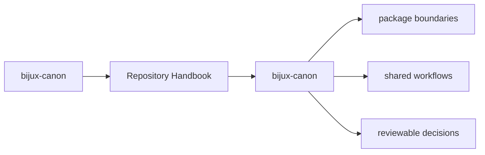
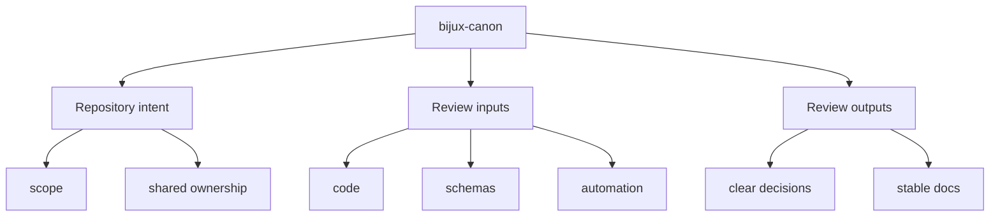

# bijux-canon

The repository handbook explains the shared boundary around the monorepo:
package layout, schema governance, documentation standards, validation, and
release expectations that apply above any single package.

<strong>The monorepo is a coordination layer.</strong>
Product behavior lives in the publishable packages under `packages/`. Shared
repository rules live here only when they genuinely belong above package level.

## Page Maps

## Pages in This Section

- [Platform Overview](platform-overview.md)
- [Repository Scope](repository-scope.md)
- [Workspace Layout](workspace-layout.md)
- [Package Map](package-map.md)
- [API and Schema Governance](api-and-schema-governance.md)
- [Local Development](local-development.md)
- [Testing and Validation](testing-and-validation.md)
- [Release and Versioning](release-and-versioning.md)
- [Documentation System](documentation-system.md)

## Shared Package Map

- [bijux-canon-ingest](../bijux-canon-ingest/foundation/index.md) for deterministic document ingestion, chunking, retrieval assembly, and ingest-facing boundaries.
- [bijux-canon-index](../bijux-canon-index/foundation/index.md) for contract-driven vector execution with replay-aware determinism, audited backend behavior, and provenance-rich result handling.
- [bijux-canon-reason](../bijux-canon-reason/foundation/index.md) for deterministic evidence-aware reasoning, claim formation, verification, and traceable reasoning workflows.
- [bijux-canon-agent](../bijux-canon-agent/foundation/index.md) for deterministic, auditable agent orchestration with role-local behavior, pipeline control, and trace-backed results.
- [bijux-canon-runtime](../bijux-canon-runtime/foundation/index.md) for governed execution and replay authority with auditable non-determinism handling, persistence, and package-to-package coordination.

## Concrete Anchors

- `pyproject.toml` for workspace metadata and commit conventions
- `Makefile` and `makes/` for root automation
- `apis/` and `.github/workflows/` for schema and validation review

## Use This Page When

- you are dealing with repository-wide seams rather than one package alone
- you need shared workflow, schema, or governance context before changing code
- you want the monorepo view that sits above the package handbooks

## What This Page Answers

- which repository-level decision this page clarifies
- which shared assets or workflows a reviewer should inspect
- how the repository boundary differs from package-local ownership

## Reviewer Lens

- compare the page claims with the real root files, workflows, or schema assets
- check that repository guidance still stops where package ownership begins
- confirm that any repository rule described here is still enforceable in code or automation

## Honesty Boundary

These pages explain repository-level intent and shared rules, but they do not override package-local ownership or serve as evidence without the referenced files, workflows, and checks.

## Section Contract

- define the shared monorepo boundary above any single package
- point readers to the package handbooks without duplicating their local detail
- keep root rules tied to actual repository files and automation

## Reading Advice

- read this page first when the question is about workspace structure or shared governance
- move to package docs when the question becomes package-specific
- use this section as the repository-level frame before reviewing code or schemas

## Purpose

This page explains how to use the repository handbook without duplicating the package-specific detail that belongs in the package handbooks.

## Stability

This page is part of the canonical docs spine. Keep it aligned with the current repository layout and the actual package set declared in `pyproject.toml`.

## Core Claim

Each repository handbook page should make one monorepo-level decision legible enough that package-local pages do not need to reinvent root context.

## Why It Matters

Repository pages matter because they keep shared rules, schemas, workflows, and release expectations from being rediscovered separately inside each package.

## If It Drifts

- root rules become folklore instead of checked-in reference
- packages start re-explaining shared repository behavior inconsistently
- reviewers lose the ability to separate monorepo policy from package-local design
