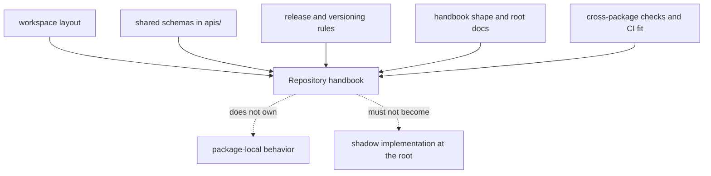

# Repository Handbook

This section is for the questions that no single package can answer on its
own. The root is not a sixth product package. It is where we explain how the
package family fits together, which assets genuinely live above one package,
and where cross-package rules begin and end.

If a reader can answer their question honestly from one package handbook, they
should go there instead of staying here.

## What The Root Actually Owns

## Pages In This Section

- [Platform Overview](platform-overview.md)
- [Repository Scope](repository-scope.md)
- [Workspace Layout](workspace-layout.md)
- [Package Map](package-map.md)
- [API and Schema Governance](api-and-schema-governance.md)
- [Local Development](local-development.md)
- [Testing and Validation](testing-and-validation.md)
- [Release and Versioning](release-and-versioning.md)
- [Documentation System](documentation-system.md)

## Use This Section For

- Questions about why the repository is split the way it is.
- Questions about root-managed assets such as `apis/`, `Makefile`, shared CI,
  and release conventions.
- Questions about where the root should stop and a product package should take
  over.

## Leave This Section For A Package Handbook When

- the answer lives mostly in one package's source tree, tests, or public surface
- the question is about one package's internal boundary rather than repository fit
- you are tempted to describe behavior at the root that really belongs inside
  `packages/`

## Package Handbooks

- [bijux-canon-ingest](../bijux-canon-ingest/foundation/index.md)
- [bijux-canon-index](../bijux-canon-index/foundation/index.md)
- [bijux-canon-reason](../bijux-canon-reason/foundation/index.md)
- [bijux-canon-agent](../bijux-canon-agent/foundation/index.md)
- [bijux-canon-runtime](../bijux-canon-runtime/foundation/index.md)

The job of this section is simple: help readers understand the system without
letting the root pretend it owns behavior that belongs elsewhere.
