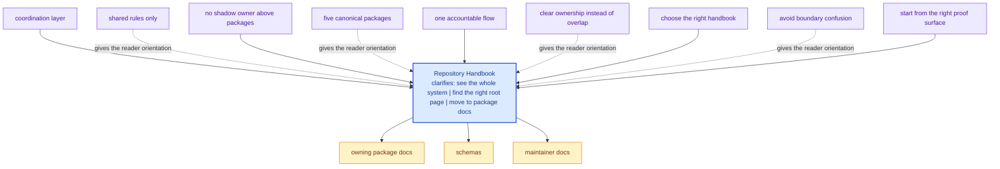

# Repository Handbook

The repository handbook explains the shared story above the package level:
why this repository is split, which rules genuinely live at the root, and
how the packages stay coordinated without collapsing back into one blurry
codebase.

`bijux-canon` is easiest to understand if you start from intent instead of
from filenames. The repository exists to keep several deterministic,
reviewable surfaces moving together: ingest prepares evidence, index makes
retrieval executable, reason makes claims inspectable, agent turns role-based
work into orchestrated runs, and runtime decides what execution and replay
results are acceptable.

The repository is therefore less like a toolbox and more like a chain of
accountable boundaries. Each package is meant to carry one kind of promise
clearly enough that readers do not have to reverse-engineer the whole tree to
understand where authority lives.

<strong>The root is a coordination layer, not a shadow owner.</strong>
Product behavior should stay inside the publishable packages under `packages/`.
The root only owns what is genuinely shared: workspace layout, schema
governance, documentation rules, validation posture, and release
coordination.

These repository pages should explain the cross-package frame that no single package can explain alone. They are strongest when they make the monorepo easier to understand without turning the root into a second owner of package behavior.

## Visual Summary

## Pages in This Section

- [Platform Overview](platform-overview.md)
- [Repository Scope](repository-scope.md)
- [Workspace Layout](workspace-layout.md)
- [Package Map](package-map.md)
- [API and Schema Governance](api-and-schema-governance.md)
- [Local Development](local-development.md)
- [Testing and Validation](testing-and-validation.md)
- [Release and Versioning](release-and-versioning.md)
- [Documentation System](documentation-system.md)

## Shared Package Map

- [bijux-canon-ingest](../bijux-canon-ingest/foundation/index.md) for deterministic document ingestion, chunking, retrieval assembly, and ingest-facing boundaries.
- [bijux-canon-index](../bijux-canon-index/foundation/index.md) for contract-driven vector execution with replay-aware determinism, audited backend behavior, and provenance-rich result handling.
- [bijux-canon-reason](../bijux-canon-reason/foundation/index.md) for deterministic evidence-aware reasoning, claim formation, verification, and traceable reasoning workflows.
- [bijux-canon-agent](../bijux-canon-agent/foundation/index.md) for deterministic, auditable agent orchestration with role-local behavior, pipeline control, and trace-backed results.
- [bijux-canon-runtime](../bijux-canon-runtime/foundation/index.md) for governed execution and replay authority with auditable non-determinism handling, persistence, and package-to-package coordination.

## Concrete Anchors

- `pyproject.toml` for workspace metadata and commit conventions
- `Makefile` and `makes/` for root automation
- `apis/` and `.github/workflows/` for schema and validation review

## Use This Page When

- you are dealing with repository-wide seams rather than one package alone
- you need shared workflow, schema, or governance context before changing code
- you want the monorepo view that sits above the package handbooks

## Decision Rule

Use `Repository Handbook` to decide whether the current question is genuinely repository-wide or whether it belongs back in one package handbook. If the answer depends mostly on one package's local behavior, this page should redirect instead of absorbing detail that the package should own.

## What This Page Answers

- which repository-level decision this page clarifies
- which shared assets or workflows a reviewer should inspect
- how the repository boundary differs from package-local ownership

## Reviewer Lens

- compare the page claims with the real root files, workflows, or schema assets
- check that repository guidance still stops where package ownership begins
- confirm that any repository rule described here is still enforceable in code or automation

## Honesty Boundary

These pages explain repository-level intent and shared rules, but they do not override package-local ownership. They also do not count as proof by themselves; the real backstops are the referenced files, workflows, schemas, and checks.

## Next Checks

- move to the owning package docs when the question stops being repository-wide
- check root files, schemas, or workflows named here before trusting prose alone
- use maintainer docs next if the root issue is really about automation or drift tooling

## Purpose

This page gives the shortest credible explanation of why the monorepo exists and what kind of questions belong in the repository handbook instead of a package handbook.

## Stability

This page is part of the canonical docs spine. Keep it aligned with the current repository layout and the actual package set declared in `pyproject.toml`.
