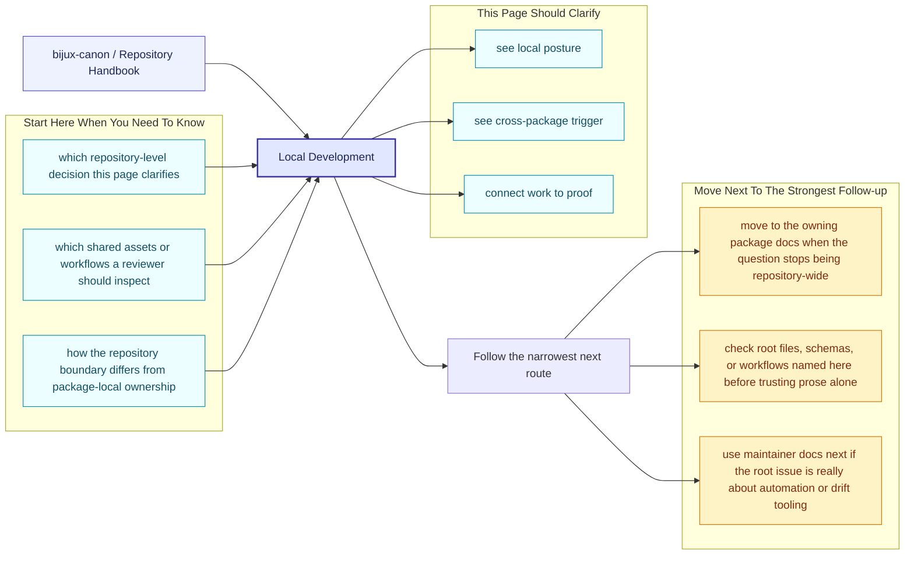
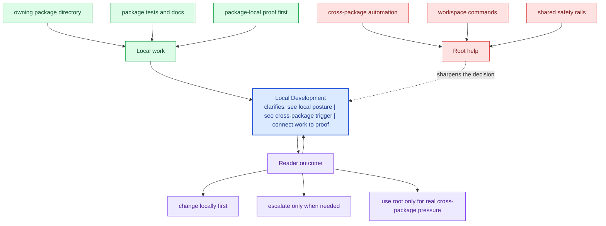

# Local Development

Local work should happen through the publishable packages plus the root
orchestration commands that keep the repository consistent. The goal is not to
make every task happen at the root; it is to make cross-package work visible
when it truly becomes cross-package.

These repository pages should explain the cross-package frame that no single package can explain alone. They are strongest when they make the monorepo easier to understand without turning the root into a second owner of package behavior.

## Page Maps

## Working Rules

- make package-local changes in the owning package directory
- use root automation when the change spans packages, schemas, or docs
- keep documentation updates reviewable alongside the code that changes behavior

## Shared Inputs

- `pyproject.toml` for commitizen and workspace metadata
- `tox.ini` for root validation environments
- `Makefile` and `makes/` for common workflows

## Concrete Anchors

- `pyproject.toml` for workspace metadata and commit conventions
- `Makefile` and `makes/` for root automation
- `apis/` and `.github/workflows/` for schema and validation review

## Use This Page When

- you are dealing with repository-wide seams rather than one package alone
- you need shared workflow, schema, or governance context before changing code
- you want the monorepo view that sits above the package handbooks

## Decision Rule

Use `Local Development` to decide whether the current question is genuinely repository-wide or whether it belongs back in one package handbook. If the answer depends mostly on one package's local behavior, this page should redirect instead of absorbing detail that the package should own.

## What This Page Answers

- which repository-level decision this page clarifies
- which shared assets or workflows a reviewer should inspect
- how the repository boundary differs from package-local ownership

## Reviewer Lens

- compare the page claims with the real root files, workflows, or schema assets
- check that repository guidance still stops where package ownership begins
- confirm that any repository rule described here is still enforceable in code or automation

## Honesty Boundary

These pages explain repository-level intent and shared rules, but they do not override package-local ownership. They also do not count as proof by themselves; the real backstops are the referenced files, workflows, schemas, and checks.

## Next Checks

- move to the owning package docs when the question stops being repository-wide
- check root files, schemas, or workflows named here before trusting prose alone
- use maintainer docs next if the root issue is really about automation or drift tooling

## Purpose

This page records the preferred development posture for the workspace without repeating package-specific setup details.

## Stability

Keep this page aligned with the root automation files that actually exist.
