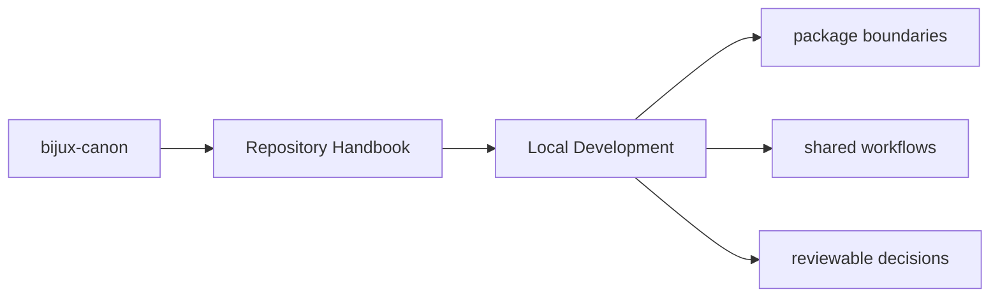
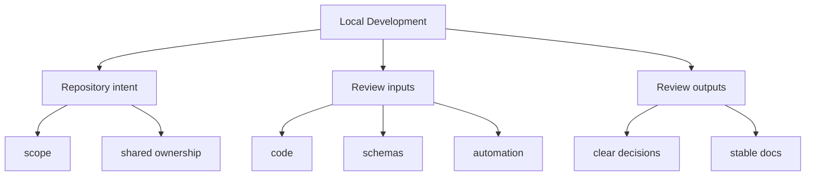

# Local Development

Local work should happen through the publishable packages plus the root
orchestration commands that keep the repository consistent.

## Page Maps

## Working Rules

- make package-local changes in the owning package directory
- use root automation when the change spans packages, schemas, or docs
- keep documentation updates reviewable alongside the code that changes behavior

## Shared Inputs

- `pyproject.toml` for commitizen and workspace metadata
- `tox.ini` for root validation environments
- `Makefile` and `makes/` for common workflows

## What This Page Answers

- which repository-level decision this page clarifies
- which shared assets or workflows a reviewer should inspect
- how the repository boundary differs from package-local ownership

## Purpose

This page records the preferred development posture for the workspace without repeating package-specific setup details.

## Stability

Keep this page aligned with the root automation files that actually exist.
