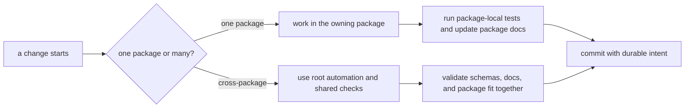

# Local Development

Local work should happen through the publishable packages plus the root
orchestration commands that keep the repository consistent. The goal is not to
make every task happen at the root. The goal is to make cross-package work
visible when it truly becomes cross-package.

## The Usual Path

## Working Rules

- make package-local changes in the owning package directory
- use root automation when the change spans packages, schemas, or docs
- keep documentation updates reviewable alongside the code that changes behavior

## Shared Inputs

- `pyproject.toml` for commitizen and workspace metadata
- `tox.ini` for root validation environments
- `Makefile` and `makes/` for common workflows

Start inside the owning package. Come to the root because the work truly spans
packages, not because the root feels more convenient.
